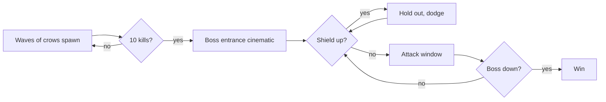

# CROW ARCHER

```
  ██████╗██████╗  ██████╗ ██╗    ██╗
 ██╔════╝██╔══██╗██╔═══██╗██║    ██║
 ██║     ██████╔╝██║   ██║██║ █╗ ██║
 ██║     ██╔══██╗██║   ██║██║███╗██║
 ╚██████╗██║  ██║╚██████╔╝╚███╔███╔╝
  ╚═════╝╚═╝  ╚═╝ ╚═════╝  ╚══╝╚══╝
        A R C H E R
```

Survive the flock, kill the Crow King. A single-file browser game: vanilla JS, HTML5 Canvas, Web Audio API. No build step, no install. Open `game.html` and play.


- [Play](#play)
- [Controls](#controls)
- [Characters](#characters)
- [Game loop](#game-loop)
- [Systems](#systems)
- [Map](#map)
- [Audio](#audio)
- [Tech](#tech)
- [Dependencies](#dependencies)
- [Design system](#design-system)
- [License](#license)

## Play

Open `game.html` in any modern browser. No server required. An internet connection is needed once, to load two CDN scripts (see [Dependencies](#dependencies)).

## Controls

| Action | Default |
|--------|---------|
| Move | Arrow keys |
| Aim | Mouse |
| Shoot / Cast | Space |
| Charge special | Right-click hold (Archer) / Right-click (Wizard) |
| Sniper mode | Shift |
| Pause | Escape |
| Inventory | I (while paused) |

All keys are remappable from the Controls screen.

## Characters

### Archer
Classic ranged fighter. Mouse-aimed arrows with a dotted aim line.
- **Primary:** Arrows, quiver of 10, refilled by pickups
- **Special:** Dynamite, hold to charge, release to throw, blast clears tiles and damages the boss
- **Pickups:** Ricochet arrows (bounce off walls with a speed boost), fire arrows (leave burning patches)

### Wizard
Teleguided magic with area control.
- **Primary:** Magic bolts, 3 s cooldown, home toward the nearest enemy, disappear on contact
- **Special:** Lightning Storm, 450 px AoE around the player, destroys ROCK and TREE tiles, damages all enemies
- **Pickups:** Fire bolt (2x damage), laser stream (passes through walls, stops on the first enemy)

### Knight
Frontline melee with a long spear.
- **Primary:** Spear thrust, 80 px directional cone, 0.9 s cooldown, 2 damage to boss
- **Special:** Whirlwind, 3-second spinning AoE (72 px radius), damages enemies and destroys ROCK and TREE tiles, 8 s cooldown
- **Pickups:** Iron Javelin (thrown piercing spear, 2 pierce charges, 3 per pickup), Fire Sword (2x damage and range for 8 s, leaves burning patches)

## Game loop



Boss shield phases:
- First 10 s: blue rotating shield, fully immune
- 5 s open window: attack freely
- Randomly re-shields for 5 s (purple ring), up to 3 times per 30-second window

## Systems

| Module | Description |
|--------|-------------|
| **FORESHADOW** | Sky tint darkens and banners appear at kill milestones leading up to the boss |
| **STREAK** | Announcer chain: Double Kill, Multi Kill, Mega Kill, Ultra Kill, Monster Kill |
| **FEATHERS** | Meta-currency earned from kills, persisted in `localStorage`. Spend on upgrades (arrows, HP, range, speed) in the inventory screen |
| **HANDICAP** | `CONFIG.handicap` (0 to 100) rubber-bands crow speed and drop rate for accessibility |
| **BOUNTIES** | Two active micro-objectives tied to kill streaks, bonus rewards on completion |

## Map

- 25 x 16 procedural tile grid (EMPTY, ROCK, WATER, TREE, ASH)
- Player spawns in a guaranteed clear zone, crows enter from the right corridor
- Trees burn to ash on boss arrival, opening the arena
- Dynamite, Lightning Storm and Whirlwind destroy ROCK and TREE tiles permanently

## Audio

All sound is synthesized at runtime, no audio files. Sounds initialize on first user gesture.

## Tech

- Single `game.html`, single `<canvas>`, all UI drawn with the Canvas 2D API
- CRT scanline aesthetic via CSS plus a vignette overlay
- Delta-time game loop on `requestAnimationFrame`
- Particle system capped at 120 active particles, oldest dropped first
- All tunable values centralized in the `CONFIG` object at the top of `game.html`
- rot.js FOV cache invalidates only when the player moves to a new tile

## Dependencies

Two CDN-loaded libraries, referenced from `game.html`; ZzFX is inlined. No npm install, no build step.

| Library | Version | Purpose | License |
|---------|---------|---------|---------|
| [ZzFX](https://github.com/KilledByAPixel/ZzFX) | inlined | Procedural sound-effect synthesizer, compact parameter arrays instead of hand-rolled synth functions | [MIT](https://github.com/KilledByAPixel/ZzFX/blob/master/LICENSE) |
| [simplex-noise](https://github.com/jwagner/simplex-noise) | 2.4.0 | Coherent 2-D noise for terrain, independent layers for rocks, water and forest so tiles cluster naturally. v2.4.0 is the last release with a browser-global build | [MIT](https://github.com/jwagner/simplex-noise/blob/master/LICENSE) |
| [rot.js](https://github.com/ondras/rot.js) | 2.2.1 | `ROT.FOV.PreciseShadowcasting` for crow line-of-sight, `ROT.Path.AStar` so aggro crows path around obstacles | [BSD-2-Clause](https://github.com/ondras/rot.js/blob/master/LICENSE) |

## Design system

Every entity, particle event and animation curve is specified in [.design-system/](.design-system/README.md): draw specs in pixels and hex, live preview cards, and a playable UI kit demo.

## License

[MIT](LICENSE)
