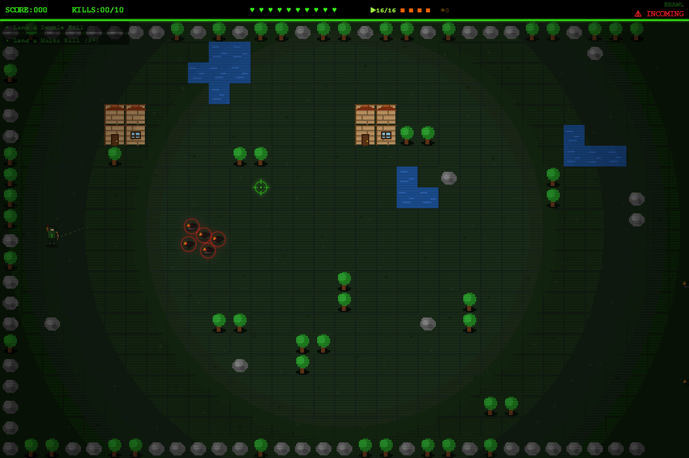

# CROW ARCHER

[](https://github.com/MrBisonte/crow-archer/actions/workflows/ci.yml)
[](LICENSE)


```
  ██████╗██████╗  ██████╗ ██╗    ██╗
 ██╔════╝██╔══██╗██╔═══██╗██║    ██║
 ██║     ██████╔╝██║   ██║██║ █╗ ██║
 ██║     ██╔══██╗██║   ██║██║███╗██║
 ╚██████╗██║  ██║╚██████╔╝╚███╔███╔╝
  ╚═════╝╚═╝  ╚═╝ ╚═════╝  ╚══╝╚══╝
        A R C H E R
```

Survive the flock, kill the Crow King, then the two dark bosses waiting in his castle. A browser game on HTML5 Canvas and the Web Audio API, every sound synthesized at runtime, built to one self-contained HTML file. Download [`dist/index.html`](dist/index.html) and play, offline, no install.



- [Play](#play)
- [Multiplayer](#multiplayer)
- [Controls](#controls)
- [Characters](#characters)
- [Docs](#docs)
- [License](#license)

## Play

**Single-player**, offline, no server: download [`dist/index.html`](dist/index.html) and open it in any modern browser. Every dependency is inlined.

**Multiplayer** needs a server. See [Multiplayer](#multiplayer).

To run either from source:

```
npm install
npm run dev
```

`npm run dev` alone serves single-player. Multiplayer additionally needs `npm run server`, covered below.

`npm run build` regenerates `dist/index.html`. The committed copy is built from the current `master`.

## Multiplayer

Up to four players in a room, co-op or 2v2, on a fresh generated map every match.

1. Open the server's URL and press **M**.
2. One player presses **H** to host, which shows a four-letter code. Everyone else presses **J**, types the code, and hits **Enter**.
3. The host picks a map, a mode, and a win condition, everyone readies up with **R**, and the match starts.

To run it locally:

```
npm run server
npm run dev
```

See the [manual](docs/manual.md#multiplayer) for hosting others, deploying, and full mechanics.

## Controls

| Action | Default |
|--------|---------|
| Move | Arrow keys |
| Aim | Mouse |
| Shoot / Cast | Space |
| Charge special | Right-click hold (Archer) / Right-click (Wizard, Knight) / Right-click twice: throw, then arm (Ranger) |
| Sniper mode | Shift |
| Pause | Escape |
| Inventory | I (while paused) |

Move, Shoot, Sniper mode and Pause are remappable from the Controls screen.

## Characters

| | weapon | rhythm |
|---|---|---|
| **Archer** | bow | fastest shots, weakest hit: about five to kill |
| **Wizard** | staff | slow, hard-hitting bolts that steer toward whoever is nearest |
| **Knight** | spear | nothing at range; a thrust that lands twice per swing |
| **Ranger** | crossbow | three smaller, weaker bolts per shot, each an independent hit |

See the [manual](docs/manual.md#characters) for the full kit of each: primary, special, and pickups.

## Docs

| Doc | For |
|---|---|
| [Game manual](docs/manual.md) | Full character kits, systems, map, bosses, game loop, hosting and deploying |
| [Architecture](docs/architecture.md) | Tech stack, dependencies, netcode, design patterns |

## License

[MIT](LICENSE)
