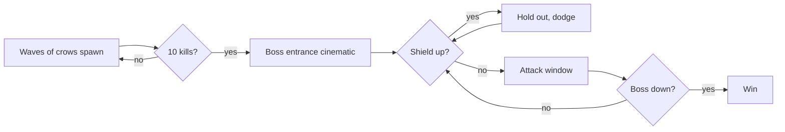

# CROW ARCHER

```
  ██████╗██████╗  ██████╗ ██╗    ██╗
 ██╔════╝██╔══██╗██╔═══██╗██║    ██║
 ██║     ██████╔╝██║   ██║██║ █╗ ██║
 ██║     ██╔══██╗██║   ██║██║███╗██║
 ╚██████╗██║  ██║╚██████╔╝╚███╔███╔╝
  ╚═════╝╚═╝  ╚═╝ ╚═════╝  ╚══╝╚══╝
        A R C H E R
```

Survive the flock, kill the Crow King. A browser game on HTML5 Canvas and the Web Audio API, built to one self-contained HTML file. Download [`dist/index.html`](dist/index.html) and play, offline, no install.


- [Play](#play)
- [Controls](#controls)
- [Characters](#characters)
- [Game loop](#game-loop)
- [Systems](#systems)
- [Map](#map)
- [Audio](#audio)
- [Tech](#tech)
- [Dependencies](#dependencies)
- [Design system](#design-system)
- [License](#license)

## Play

Download [`dist/index.html`](dist/index.html) and open it in any modern browser. Every dependency is inlined, so it needs no server and no internet connection.

To run from source:

```
npm install
npm run dev
```

`npm run build` regenerates `dist/index.html`. The committed copy is built from the current `master`.

## Multiplayer

Up to four players in a room, co-op or 2v2. The server runs the only simulation; each client predicts its own movement so your body answers the keyboard without waiting for a round trip, and draws everyone else 100 ms in the past so they move smoothly.

Running it locally takes both halves:

```
npm run server
npm run dev
```

The dev server proxies the socket through to the game server, so `http://localhost:8081` reaches both.

The client talks to whichever origin served the page, so nothing is configured at build time. A page opened straight from disk has no origin and falls back to `ws://127.0.0.1:8082/ws`. `?server=wss://host/ws` overrides either.

### Deploying

One image builds the client and the server and serves both from one port:

```
docker build -t crow-archer .
docker run -p 8082:8082 crow-archer
```

It reads `PORT` and answers `/healthz`, which is all any host taking a Dockerfile asks for. Without Docker, `npm run build && npm run build:server && npm start` does the same thing.

Run a single instance. Rooms live in the process's memory, so a second instance would hold rooms the first one cannot see and a player would join a code their friend is not in.

## Controls

| Action | Default |
|--------|---------|
| Move | Arrow keys |
| Aim | Mouse |
| Shoot / Cast | Space |
| Charge special | Right-click hold (Archer) / Right-click (Wizard, Knight) |
| Sniper mode | Shift |
| Pause | Escape |
| Inventory | I (while paused) |

Move, Shoot, Sniper mode and Pause are remappable from the Controls screen.

## Characters

### Archer
Classic ranged fighter. Mouse-aimed arrows with a dotted aim line.
- **Primary:** Arrows, quiver of 10, refilled by pickups
- **Special:** Dynamite, hold to charge, release to throw, blast clears tiles and damages the boss
- **Pickups:** Ricochet arrows (bounce off walls with a speed boost), fire arrows (leave burning patches)

### Wizard
Teleguided magic with area control.
- **Primary:** Magic bolts, 3 s cooldown, home toward the nearest enemy, disappear on contact
- **Special:** Lightning Storm, 450 px AoE around the player, destroys ROCK, TREE and HUT tiles, damages all enemies
- **Pickups:** Fire bolt (2x damage), laser stream (passes through walls, stops on the first enemy)

### Knight
Frontline melee with a long spear.
- **Primary:** Spear thrust, 80 px reach along the aim line, 1.5 s cooldown, 1 damage to boss
- **Special:** Whirlwind, 3-second spinning AoE (72 px radius), damages enemies and destroys ROCK, TREE and HUT tiles, 8 s cooldown
- **Pickups:** Iron Javelin (thrown piercing spear, 2 pierce charges, 3 per pickup), Fire Sword (2x damage and range for 8 s, leaves burning patches)

## Game loop


```mermaid
flowchart LR
    S[Waves of crows spawn] --> K{10 kills?}
    K -- no --> S
    K -- yes --> E[Boss entrance cinematic]
    E --> P{Shield up?}
    P -- yes --> H[Hold out, dodge]
    H --> P
    P -- no --> A[Attack window]
    A --> D{Boss down?}
    D -- no --> P
    D -- yes --> W[Win]
```

Boss shield phases:
- First 10 s: blue rotating shield, fully immune
- 5 s open window: attack freely
- Randomly re-shields for 5 s (purple ring), up to 3 times per 30-second window

## Systems

| Module | Description |
|--------|-------------|
| **FORESHADOW** | Sky tint darkens and banners appear at kill milestones leading up to the boss |
| **STREAK** | Announcer chain: Double Kill, Multi Kill, Mega Kill, Ultra Kill, Monster Kill |
| **FEATHERS** | Meta-currency earned from kills, persisted in `localStorage`. Spend on upgrades (arrows, HP, range, speed) in the inventory screen |
| **HANDICAP** | `CONFIG.handicap` (0 to 100) rubber-bands crow speed and drop rate for accessibility |
| **BOUNTIES** | Two active micro-objectives tied to kill streaks, bonus rewards on completion |

## Map

- 33 x 21 procedural tile grid (EMPTY, ROCK, WATER, TREE, ASH, HUT)
- Player spawns in a guaranteed clear zone, crows enter from the right corridor
- Trees burn to ash on boss arrival, opening the arena
- Dynamite, Lightning Storm and Whirlwind destroy ROCK, TREE and HUT tiles permanently

## Audio

All sound is synthesized at runtime, no audio files. Sounds initialize on first user gesture.

## Tech

- TypeScript and Vite. `vite-plugin-singlefile` inlines the bundle, so the build stays one HTML file
- Single `<canvas>`, all UI drawn with the Canvas 2D API
- CRT scanline aesthetic via CSS plus a vignette overlay
- Fixed 60 Hz timestep with an accumulator, capped at 8 catch-up steps per frame
- Simulation and rendering are separating into `src/sim/` and `src/render/`, joined by an event bus: the sim states what happened, rendering decides how it looks and sounds
- Particle system capped at 120 active particles, oldest dropped first
- All tunable values centralized in the `CONFIG` object at the top of `src/legacy/game.js`
- rot.js FOV cache invalidates only when the player moves to a new tile
- `vitest` covers the extracted sim modules; `npm test` and `npm run typecheck` gate changes

## Dependencies

Two npm packages, bundled into the build. The ZzFX-compatible synth is written into the source rather than installed. The server adds [`ws`](https://github.com/websockets/ws) ([MIT](https://github.com/websockets/ws/blob/master/LICENSE)), which the client build does not include.

| Library | Version | Purpose | License |
|---------|---------|---------|---------|
| [simplex-noise](https://github.com/jwagner/simplex-noise) | 2.4.0 | Coherent 2-D noise for terrain, independent layers for rocks, water and forest so tiles cluster naturally | [MIT](https://github.com/jwagner/simplex-noise/blob/master/LICENSE) |
| [rot.js](https://github.com/ondras/rot.js) | 2.2.1 | `FOV.PreciseShadowcasting` for crow line-of-sight, `Path.AStar` so aggro crows path around obstacles | [BSD-2-Clause](https://github.com/ondras/rot.js/blob/master/LICENSE) |

Sound comes from a small synth in `src/legacy/game.js` that reads [ZzFX](https://github.com/KilledByAPixel/ZzFX)-style positional parameter arrays. It is a partial reimplementation rather than the upstream library ([MIT](https://github.com/KilledByAPixel/ZzFX/blob/master/LICENSE)): the envelope has no decay stage, shapes 4 and 5 are noise instead of ZzFX's waveforms, and seven parameters are accepted but ignored. Every sound was tuned against this implementation, so arrays copied from the ZzFX designer will not sound the same.

## Design system

Every entity, particle event and animation curve is specified in [.design-system/](.design-system/README.md): draw specs in pixels and hex, live preview cards, and a playable UI kit demo.

## License

[MIT](LICENSE)
