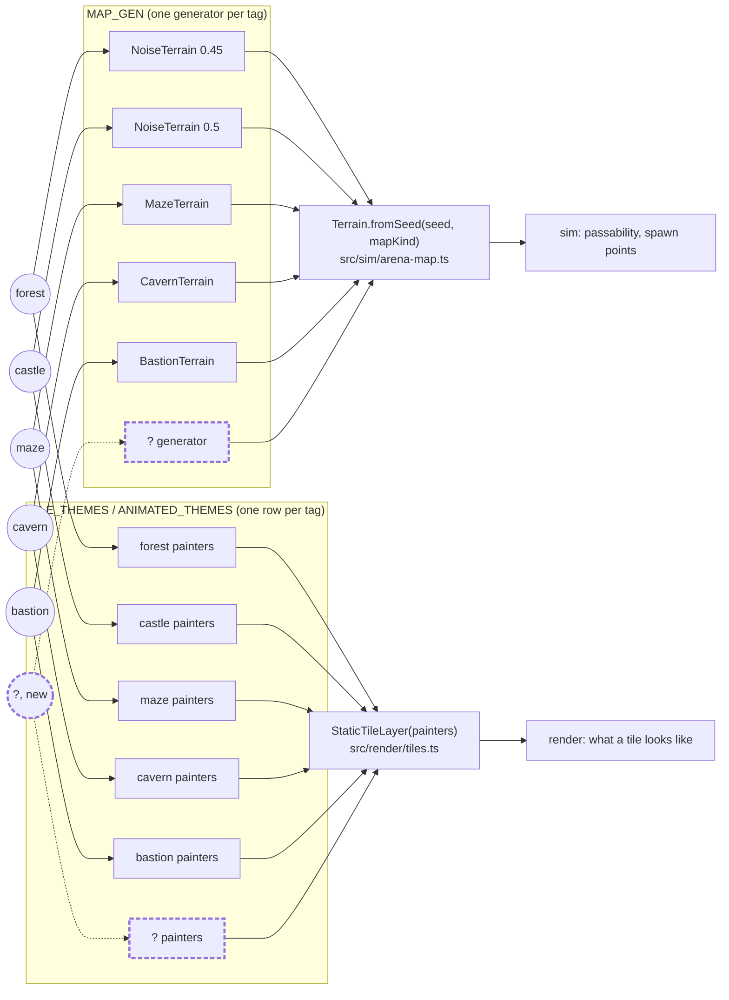

# Architecture

Tech stack, dependencies, the framework decisions behind them, and the surface the build attaches at boot. See the [README](../README.md) for the quick start and the [manual](manual.md) for how to play.

- [Tech](#tech)
- [The console verbs](#the-console-verbs)
- [Object composition](#object-composition)
- [Netcode](#netcode)
- [Dependencies](#dependencies)
- [See also](#see-also)

## Tech

- TypeScript and Vite. `vite-plugin-singlefile` inlines the bundle, so the build stays one HTML file
- Single `<canvas>`, all UI drawn with the Canvas 2D API
- CRT scanline aesthetic via CSS plus a vignette overlay
- Fixed 60 Hz timestep with an accumulator, capped at 8 catch-up steps per frame
- Simulation and rendering are separating into `src/sim/` and `src/render/`, joined by an event bus: the sim states what happened, rendering decides how it looks and sounds
- Particle system capped at 120 active particles, oldest dropped first
- All tunable values centralized in the `CONFIG` object at the top of `src/legacy/game.js`
- rot.js FOV cache invalidates only when the player moves to a new tile
- `vitest` covers the extracted sim modules; `npm test` and `npm run typecheck` gate changes

## The console verbs

Six words `src/legacy/game.js` attaches to `window` at boot, for driving the
game by hand from the browser console. They are declared on `interface Window`
in `src/legacy/globals.d.ts` and printed once at boot, so they are also
findable without this page.

They are short on purpose. The useful sequence is three chained calls on
`__game`, and every browser now refuses a pasted console line until you type
"allow pasting" at it, so the long form has to be typed out. Each of these is
one word and a number.

| Verb | Argument defaults to | What it does | Answers with |
|---|---|---|---|
| `siege(n)` | wave `1` | Switches to siege mode, opens a run on the bastion, and fast-forwards to the start of wave `n` | `{ wave, outcome, guards }` |
| `hurt(n)` | `1` | Takes `n` HP off every guard, never below 1, so the priest has work to do | one `kind hp/maxHp` line per guard |
| `crack(hp)` | `1` | Puts both towers **at** `hp`, to watch cover come off as one falls. It sets the figure rather than subtracting it | the two tower HPs |
| `retinue()` | | The retinue as readable lines: rank marker, kind, `hp/maxHp` | one string per guard |
| `draft(char)` | the selected hero | Grants every talent in `char`'s tree and starts a run, so the opening draft has a full hand to deal | the talent ids offered |
| `rite(char)` | the selected hero | Puts `char` at rank III and opens the rite ahead of the opening draft | the capstone ids offered |

`char` is a `CharacterKind`: `archer`, `wizard`, `knight`, `ranger` or
`sapper`. A hero with an empty tree or no capstones gets a plain sentence back
instead of a list, and the run starts undisturbed.

`siege(n)` walks the real `completeWave` for every wave it skips rather than
assigning the number, so the retinue that greets you on wave 9 is the one nine
cleared waves would have produced, ranks and recruits and all. `outcome` is a
`SiegeOutcome` and `guards` is a count.

`retinue()`'s rank marker is one `*` per rank, `RANK_MARK` in
`src/sim/guards.ts`, and rank 0 has none.

`hurt`, `crack` and `retinue` read the siege field, and that field only exists
while a siege is running. Anywhere else there are no guards and no towers, so
all three answer with an empty list; `siege(n)` is what puts you somewhere they
mean something.

`draft` and `rite` grant into the in-memory talent bank without writing it, but
a purchase or a banked milestone later in the same page saves the whole bank.
Stage a tree on a save you care about and it can reach `localStorage`.
[Talents](talents.md#where-the-code-lives) says what the two screens are for.

`window.__game` is the other half of this surface: the dev-hook object the
headless tests drive, over a hundred members wide. A dev hook is for a test,
which can afford to be explicit; these six are for a person at a console who
cannot. It is not a curated set and it is not listed here.

`src/legacy/globals.coverage.test.ts` holds the table above to the same set as
the declarations in `globals.d.ts`, the assignments in `game.js` and the boot
banner. A verb missing from any of the four fails by name, and so does a name
in any of them that no longer exists.

## The flight recorder

Dev-only telemetry for monitored playtests. While `npm run dev` serves the
game, the page POSTs a beat to `/__flight` once a second: the run's vitals
from `devHooks.pulse()`, plus everything `src/sim/log.ts` recorded since the
last beat. The dev server appends each one to a JSONL file under
`_flightlogs/`, stamped with its own receive time. A freeze then reads from
the outside. An exception arrives as an `err` line with the stack. A dead
loop, a held sim or a page that stopped animating raises an `alarm` line
that classifies itself and attaches `movementBlockers()`. A hard hang is the
one that sends nothing: the gap between `srv` stamps is its timestamp, and a
closed tab tells itself apart by the goodbye it sends on the way out.

`src/dev/flight-recorder.ts` is the page half and states the decision table;
`src/dev/flight-sink.ts` is the server half. On by default under `npm run dev`
(`?rec=0` opts out); the release build carries none of it. The recorder raises
the log floor to `debug` and turns the `?perf` tracer on at `time`, so the
beats carry per-section frame costs without either being asked for.
`scripts/flight-watch.mjs` (`npm run flight:watch`) follows the newest log and
turns it into one line per event, beat-gap hang detection included.
The launch recipe and the log's line-by-line wire format:
[the monitored-playtest playbook](playbooks/monitored-playtest.md).

## Object composition

Reference for every kind-tagged content system: what the tag is, which
tables key off it, and what actually happens when a new value is added.
Rationale and worked examples for *why* this shape was chosen live in
[Design patterns](design-patterns.md#composition-over-inheritance-character-definition),
and the case for one number per character rather than a column per boss in
[One dial per character](design-patterns.md#one-dial-per-character-not-a-column-per-boss);
this section is the flat data reference across every kind, not just
character.

### At a glance

| Class | Kind type | Values today | Tables keyed on it | Cross-cuts |
|---|---|---|---|---|
| Character | `CharacterKind` | `archer \| wizard \| knight \| ranger \| sapper` | `PRIMARY`, `SILHOUETTES`, `PAINTERS`, `CHARACTER_STATS`, `CHARACTER_KEYS` | sim, render, net, ui |
| Map | `MapKind` | `forest \| castle \| maze \| cavern \| bastion` | `MAP_GEN`, `MAP_RULES`, `TILE_THEMES`, `ANIMATED_THEMES`, `MAP_KEYS` | sim, render, net, ui |
| Pickup (multiplayer) | `PickupKind` | `shield \| fire` | `EFFECTS` | sim |
| Skeleton (single-player) | plain string | `normal \| fire \| ice \| rat` | `SKELETON_PALETTES` | `src/legacy/game.js` only |
| Boss | plain string, **HP tabled, behavior branched** | `crowking \| dark_archer \| dark_knight \| minotaur \| commander` | `BOSS_HP_KEY` (HP), `BOSS_ON_HIT`, `BOSS_HUNTS_WHILE_EXPLORING` (see [Boss: the deliberate exception](#boss-the-deliberate-exception)) | `src/legacy/game.js` only |
| Guard (single-player) | `GuardKind` = `RecruitableGuardKind \| UniqueGuardKind` | `archer \| foot_soldier \| knight` + `priest` | `GUARD_STATS`, `GUARD_PALETTES`, `GUARD_GRID_BUILDERS`; `RECRUIT_WEIGHTS` keyed on the recruitable half only | sim, render |
| Weapon | implicit, via `PRIMARY` | `Bow \| Staff \| Spear \| Crossbow \| PowderCharge` | each implements the `Weapon` interface | sim, net |

Two systems only exist in `src/legacy/game.js` (skeletons, bosses): the
castle stage's monster content is single-player-only today, with no
protocol representation for it in multiplayer.

### How a new map value flows through the tables



Same shape as the character diagram in design-patterns.md: a new `MapKind`
value is one new circle, one row in each table. `TILE.ROCK` still means
"blocks movement and shots" in every theme; only the art differs, so
`Terrain`'s collision code never has to know a theme exists.

The row a generator holds stopped being a config value when the maze
arrived: `MAP_GEN` holds the generator itself, because a maze is not the
noise algorithm at any density. Forest and castle are the same `NoiseTerrain`
at two settings; the maze is carved and the cavern is grown. See
[Level 3: the maze](level-3-maze.md).

One table is not keyed on `MapKind` and is worth knowing about:
`MAP_PANEL_INFO` in `src/legacy/game.js` holds only the presentation of the
Waves map-select panels, and *membership* of that screen is derived from
`runsWaves(kind)` rather than listed. A map earns a panel by fielding a
population that escalates on the wave timer, which is not the same thing as
having crows: `MAP_RULES[kind].population` is one of `crows`, `soldiers`,
`scripted` or `siege`, and only the first two run waves. The last two are
distinct rather than folded together because a scripted map has no wave count
at all while a siege has exactly ten. `MAP_PANELS` throws at load if
a map earns one and has no presentation row, so the half that cannot be
derived fails early instead of drawing blank.

### Map selection: where the free choice actually lives

**Decision (2026-08-21):** map is a real, player-facing choice in exactly
two places. Everywhere else it is fixed. Logged as ROADMAP.md decision 9.

**Still two, after the bastion (2026-08-24).** Siege mode adds a third
*context* but not a third free choice: its map is fixed, because a siege is a
place rather than a setting — the towers, the barrier and the corridor are the
mode, so offering it on the forest would be offering a different game under the
same name. The decision holds as written.

| Context | Map choice | Mechanism |
|---|---|---|
| Multiplayer lobby | **Free**, host-selected | `SET_MAP` → `Room.setMap()` → `MATCH_START` |
| Single-player, Waves mode | **Free**, player-selected | mapselect screen (`MAP_PANELS`, filtered by `runsWaves`) → `selectedMapKind` → `initGame()` |
| Single-player, Brawl mode | **Fixed** | `generateMap('castle')` when the Crow King dies, `'maze'` when the Dark Knight does, `'bastion'` through the maze door: story beats, not a menu |
| Single-player, Siege mode | **Fixed** | `MODE_RULES.siege.fixedMap` is `'bastion'`, read by `initGame()`; the mapselect screen is skipped because it has nothing to ask |

```mermaid
sequenceDiagram
    participant Host
    participant Lobby as Lobby (client)
    participant Server
    participant Match as MatchView (client)

    Host->>Lobby: press map key (table-driven, mirrors CHARACTER_KEYS)
    Lobby->>Server: SET_MAP
    Server->>Server: host-only Room.setMap(mapKind)
    Server-->>Lobby: ROOM_STATE (mapKind)
    Note over Lobby: every player sees the pick; only the host can change it
    Host->>Server: ready
    Server->>Match: MATCH_START (mapKind, seed)
    Match->>Match: Terrain.fromSeed(seed, mapKind)
    Match->>Match: StaticTileLayer(TILE_THEMES[mapKind])
```

Single-player's mode (`SinglePlayerMode`, `'brawl' | 'waves' | 'siege'`, in
`src/sim/game-mode.ts`) is a different, older concept from multiplayer's
`GameMode` (`'coop' | 'deathmatch'`, `src/net/protocol.ts`). Same word,
unrelated values, picked at the main menu rather than per match. It was a bare
string compared in eleven places inside the monolith until it became
`MODE_RULES`; the rename to `SinglePlayerMode` is there so the two stop being
confusable by name alone.

### Boss: the deliberate exception

`boss.kind` (`'crowking' | 'dark_archer' | 'dark_knight' | 'minotaur' |
'commander'`, `src/legacy/game.js`) is a plain string with five values, and
what keys off it is split by field, not by kind.

| Field | Where it lives | What a row is |
|---|---|---|
| HP | `BOSS_HP_KEY` | one CONFIG key per boss, the same pool whoever is fighting it |
| What a landed hit does | `BOSS_ON_HIT` | one function per kind |
| Alive outside a boss fight | `BOSS_HUNTS_WHILE_EXPLORING` | one flag per kind |
| Shield window, orbit vs. charge tuning, secondary attacks | branched, no table | no row: genuinely divergent algorithm, not a shared data shape a table could hold |

A table earns its keep when new rows are mostly data, and a boss is mostly
algorithm, which is the same call `GameMode` makes over `CharacterKind`. The
two behavior tables are not a counter-example: a row holds a function or a
flag that selects one, so they are that branch written out per kind, which
makes a fifth boss answer the question rather than inherit whichever answer
an `if` happened to give it.

HP is the one field that failed the test the other way. It used to be twelve
hand-tuned numbers, four bosses times three named characters, read by a
ternary on `selectedChar`; it is one pool per boss now, scaled by one
`bossDamageMult` per character, so the two axes add instead of multiplying.
Same test, applied per field rather than per kind. See
[One dial per character](design-patterns.md#one-dial-per-character-not-a-column-per-boss)
for the decision and [Balance](balance.md#boss-health) for the numbers.

The minotaur is why the split is worth naming, and the siege sharpened it. In
the maze `bossHpFor` answers `Infinity` for him and a hit buys a stun rather
than damage — he is that level's pressure, not its objective. A siege fields
him inside wave ten, where a wave cannot clear until every boss in it is
dead, so there he reads a real pool (`keeperHP`) and the same hit both stuns
and wounds. One kind, two answers, chosen by the run rather than by the tag.

None of these are `Record`s the compiler checks, so a stage added without a
row in each is `undefined` at the call site rather than a build failure, and
the three call sites fail three different ways: a missing `BOSS_ON_HIT` row
throws `TypeError` on the first hit that lands, a missing
`BOSS_HUNTS_WHILE_EXPLORING` row reads as `false`, and a missing
`BOSS_HP_KEY` row spawns a boss on `undefined` health. The commander shipped
missing two of the three. A loop over `BOSS_STAGES` now refuses to load
without a row in every table, which is the same guard `MAP_PANELS` and
`CHAR_PANELS` already run for the half of their data that cannot be derived.

### Data structures (verified against current code)

```ts
// src/net/protocol.ts
type CharacterKind = 'archer' | 'wizard' | 'knight' | 'ranger' | 'sapper'

// src/sim/arena.ts
interface CharacterStats { speed: number; maxHp: number; bossDamageMult: number }
const CHARACTER_STATS: Record<CharacterKind, CharacterStats>
// rows are no longer identical; the figures are in docs/balance.md

// src/sim/arena-map.ts
type MapKind = 'forest' | 'castle' | 'maze' | 'cavern' | 'bastion'
const MAP_GEN: Record<MapKind, MapGenerator>
const MAP_RULES: Record<MapKind, {
  destructibleTerrain: boolean; fogOfWar: boolean; population: MapPopulation
  enemySpeed: number
}>
type MapPopulation = 'crows' | 'soldiers' | 'scripted' | 'siege'
const runsWaves: (kind: MapKind) => boolean

// src/sim/map-generators.ts
interface MapGenerator { generate(rows, cols, rng, noise): TileGrid }
class NoiseTerrain   // thresholded noise: forest, castle
class MazeTerrain    // recursive backtracker, braided
class CavernTerrain  // cellular automata, then joined into one region
class BastionTerrain // fixed layout, seeded scatter, reserved skeleton

// src/render/tiles.ts
const TILE_THEMES: Record<MapKind, Partial<Record<TileId, TilePainter>>>
const ANIMATED_THEMES: Record<MapKind, AnimatedPalette>

// src/ui/lobby-controller.ts
const MAP_KEYS: Record<MapKind, string>

// src/sim/pickups.ts
type PickupKind = 'shield' | 'fire'
const EFFECTS: Record<PickupKind, (target: Empowerable) => void>

// src/sim/tilemap.ts
const TILE =
  { EMPTY: 0, ROCK: 1, WATER: 2, TREE: 3, ASH: 4, HUT: 5, SAPLING: 6 } as const
const tilePassable = (t: TileId) =>
  t === TILE.EMPTY || t === TILE.ASH || t === TILE.SAPLING

// src/sim/regrowth.ts
class Regrowth  // ash -> sapling -> tree, on destructibleTerrain maps only

// src/sim/game-mode.ts
type SinglePlayerMode = 'brawl' | 'waves' | 'siege'
const MODE_RULES: Record<SinglePlayerMode, ModeRule>

// src/sim/siege-run.ts, siege-waves.ts, guards.ts, towers.ts, bestiary.ts
type SiegeOutcome = 'running' | 'won' | 'lost'
type RecruitableGuardKind = 'archer' | 'foot_soldier' | 'knight'
type UniqueGuardKind = 'priest'
type GuardKind = RecruitableGuardKind | UniqueGuardKind
const RECRUIT_WEIGHTS: Record<RecruitableGuardKind, number>  // a priest cannot have one
const GUARD_STATS: Record<GuardKind, GuardStats>
const SIEGE_WAVE_COUNT = 10
const TOWER_MAX_HP = 20, TOWER_SPAN = 2, TOWER_DAMAGE = 2
const BESTIARY: Record<EnemyKind, EnemyEntry>  // 9 critters, 5 bosses

// src/legacy/game.js: single-player only, not compiler-checked
let gameMode  // a SinglePlayerMode string; every rule read via MODE_RULES
const SKELETON_PALETTES: Record<'normal' | 'fire' | 'ice' | 'rat', Palette>
// boss.kind is a plain string; BossKind is this block's name for its five values
type BossKind = 'crowking' | 'dark_archer' | 'dark_knight' | 'minotaur' | 'commander'
const BOSS_HP_KEY: Record<Exclude<BossKind, 'minotaur'>, string>  // kind -> CONFIG key
const BOSS_ON_HIT: Record<BossKind, (amount: number) => void>
const BOSS_HUNTS_WHILE_EXPLORING: Record<BossKind, boolean>
```

`CharacterKind` and its five tables are the most complete instance of this
pattern and are documented in full, with the rejected class-hierarchy
alternative, in
[Design patterns](design-patterns.md#composition-over-inheritance-character-definition).

### Transformations worth knowing about

- **Wire packing.** A `Kind` value is a string, so it survives
  `JSON`/the wire format for free. Richer state (player position, HP) is
  packed into fixed-size numbers by `packPlayerState`
  (`src/net/entity-state.ts`) and unpacked client-side; kinds themselves
  are never packed, just sent as-is.
- **sim → render.** Neither `sim/` nor its tables know about `HTMLCanvas`.
  A kind resolves to *data* (a `Weapon` instance, a density number, a
  painter table lookup) inside `sim/`, and `render/` is where that data
  becomes pixels. This is the same split the "Tech" section above
  describes for the engine generally, just applied per-kind.
- **Legacy game.js is a separate build, not a port.** Single-player's
  `src/legacy/game.js` shares some tables directly with the TS side
  (`generateMap()` imports `MAP_GEN`/`TILE_THEMES` for real) but
  reimplements others by hand (`CHAR_PANELS` is a plain array, not a
  `Record`; pickups have a third kind, `'ricochet'`, that the multiplayer
  `PickupKind` doesn't). Where the two diverge it's deliberate: PvE and
  PvP numbers are tuned separately. It means "add a kind" is two separate
  edits today, not one. `CHARACTER_STATS` now carries that seam inside one
  table: `BattleWorld` reads `speed` and `maxHp` out of it, so the roster's
  bodies really are shared, while `bossDamageMult` in the same row is read
  only by `src/legacy/game.js`, because multiplayer has no bosses. The field
  name carries its own scope. See [Balance](balance.md#multiplayer).

## Netcode

The server runs the only simulation. Each client predicts its own movement so your body answers the keyboard without waiting for a round trip, and draws everyone else 100 ms in the past so they move smoothly.

Arrows are the server's: it decides where they go and what they hit. Your own movement is predicted locally, so it stays instant, but an arrow appears a round trip after you ask for it. That is the deliberate trade. The alternative is drawing arrows the server later disagrees with and having to take them back.

Every match uses a fresh generated map (rock, trees, water and huts) built independently on both machines from the same four-byte seed rather than sent over the wire.

## Dependencies

Two npm packages, bundled into the build. The ZzFX-compatible synth is written into the source rather than installed. The server adds [`ws`](https://github.com/websockets/ws) ([MIT](https://github.com/websockets/ws/blob/master/LICENSE)), which the client build does not include.

| Library | Version | Purpose | License |
|---------|---------|---------|---------|
| [simplex-noise](https://github.com/jwagner/simplex-noise.js) | 2.4.0 | Coherent 2-D noise for terrain, independent layers for rocks, water and forest so tiles cluster naturally | [MIT](https://github.com/jwagner/simplex-noise.js/blob/main/LICENSE) |
| [rot.js](https://github.com/ondras/rot.js) | 2.2.1 | `FOV.PreciseShadowcasting` for crow line-of-sight, `Path.AStar` so aggro crows path around obstacles | [BSD-2-Clause](https://github.com/ondras/rot.js/blob/master/license.txt) |

Sound comes from a small synth in `src/legacy/game.js` that reads [ZzFX](https://github.com/KilledByAPixel/ZzFX)-style positional parameter arrays. It is a partial reimplementation rather than the upstream library ([MIT](https://github.com/KilledByAPixel/ZzFX/blob/master/LICENSE)): the envelope has no decay stage, shapes 4 and 5 are noise instead of ZzFX's waveforms, and seven parameters are accepted but ignored. Every sound was tuned against this implementation, so arrays copied from the ZzFX designer will not sound the same. Those two noise shapes never read the oscillator phase either, so on a noise sound the pitch half of the layout — including `randomness`, the field a repeated sound would otherwise vary through — is computed and discarded.

A sound is therefore varied where every shape can hear it: `playSound` nudges volume, frequency and release per play, inside `CONFIG.soundVariation` and clamped so a tunable cannot turn texture into a new sound each time. Sounds the player learns by ear — the UI's answers, a boss's signature — opt out by playback kind rather than by a flag at the call site. See `src/render/sound-variation.ts`.

## See also

- [Design patterns](design-patterns.md): composition over inheritance for character definitions
- [Playbooks](playbooks/README.md): what building this game has cost, one file per kind of work, kept separate from how it is put together
- [Balance](balance.md): what every character and every boss is worth, and the one rule relating them
- [Level 3: the maze](level-3-maze.md): why a third map breaks `MAP_GEN`'s row shape, and the Strategy table proposed to fix it. Historical — written before the maze existed
- [Level 5: the bastion](level-5-bastion.md): the siege map, its retinue and its ladder, and why the whole feature gates on the map rather than the mode
- [Design system](../.design-system/README.md): draw specs in pixels and hex, live preview cards, a playable UI kit demo
