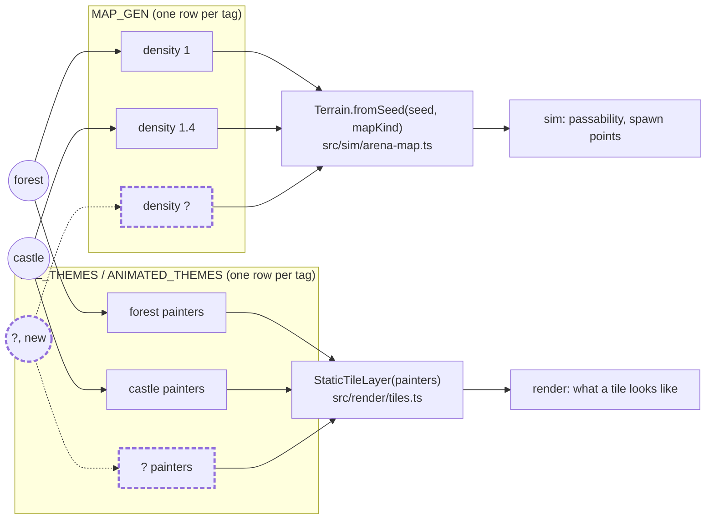

# Architecture

Tech stack, dependencies and the framework decisions behind them. See the [README](../README.md) for the quick start and the [manual](manual.md) for how to play.

- [Tech](#tech)
- [Object composition](#object-composition)
- [Netcode](#netcode)
- [Dependencies](#dependencies)
- [See also](#see-also)

## Tech

- TypeScript and Vite. `vite-plugin-singlefile` inlines the bundle, so the build stays one HTML file
- Single `<canvas>`, all UI drawn with the Canvas 2D API
- CRT scanline aesthetic via CSS plus a vignette overlay
- Fixed 60 Hz timestep with an accumulator, capped at 8 catch-up steps per frame
- Simulation and rendering are separating into `src/sim/` and `src/render/`, joined by an event bus: the sim states what happened, rendering decides how it looks and sounds
- Particle system capped at 120 active particles, oldest dropped first
- All tunable values centralized in the `CONFIG` object at the top of `src/legacy/game.js`
- rot.js FOV cache invalidates only when the player moves to a new tile
- `vitest` covers the extracted sim modules; `npm test` and `npm run typecheck` gate changes

## Object composition

Reference for every kind-tagged content system: what the tag is, which
tables key off it, and what actually happens when a new value is added.
Rationale and worked examples for *why* this shape was chosen live in
[Design patterns](design-patterns.md#composition-over-inheritance-character-definition);
this section is the flat data reference across every kind, not just
character.

### At a glance

| Class | Kind type | Values today | Tables keyed on it | Cross-cuts |
|---|---|---|---|---|
| Character | `CharacterKind` | `archer \| wizard \| knight \| ranger` | `PRIMARY`, `SILHOUETTES`, `PAINTERS`, `CHARACTER_STATS`, `CHARACTER_KEYS` | sim, render, net, ui |
| Map | `MapKind` | `forest \| castle` | `MAP_GEN`, `TILE_THEMES`, `ANIMATED_THEMES` | sim, render, net |
| Pickup (multiplayer) | `PickupKind` | `shield \| fire` | `EFFECTS` | sim |
| Skeleton (single-player) | plain string | `normal \| fire \| ice` | `SKELETON_PALETTES` | `src/legacy/game.js` only |
| Boss | plain string, **not tabled** | `crowking \| dark_archer \| dark_knight` | none (see [Boss: the deliberate exception](#boss-the-deliberate-exception)) | `src/legacy/game.js` only |
| Weapon | implicit, via `PRIMARY` | `Bow \| Staff \| Spear \| Crossbow` | each implements the `Weapon` interface | sim, net |

Two systems only exist in `src/legacy/game.js` (skeletons, bosses): the
castle stage's monster content is single-player-only today, with no
protocol representation for it in multiplayer.

### How a new map value flows through the tables



Same shape as the character diagram in design-patterns.md: a new `MapKind`
value is one new circle, one row in each table. `TILE.ROCK` still means
"blocks movement and shots" in every theme; only the art differs, so
`Terrain`'s collision code never has to know a theme exists.

### Map selection: where the free choice actually lives

**Decision (2026-08-21):** map is a real, player-facing choice in exactly
two places. Everywhere else it is fixed. Logged as ROADMAP.md decision 9.

| Context | Map choice | Mechanism |
|---|---|---|
| Multiplayer lobby | **Free**, host-selected | `SET_MAP` → `Room.setMap()` → `MATCH_START` |
| Single-player, Waves mode | **Free** (not yet built; today defaults to forest) | none yet; natural extension point |
| Single-player, Brawl mode | **Fixed** | `generateMap('castle')` fires once, hardcoded inside `updateBossDeath()` when the Crow King dies: a story beat, not a menu |

```mermaid
sequenceDiagram
    participant Host
    participant Lobby as Lobby (client)
    participant Server
    participant Match as MatchView (client)

    Host->>Lobby: press map key (table-driven, mirrors CHARACTER_KEYS)
    Lobby->>Server: SET_MAP
    Server->>Server: host-only Room.setMap(mapKind)
    Server-->>Lobby: ROOM_STATE (mapKind)
    Note over Lobby: every player sees the pick; only the host can change it
    Host->>Server: ready
    Server->>Match: MATCH_START (mapKind, seed)
    Match->>Match: Terrain.fromSeed(seed, mapKind)
    Match->>Match: StaticTileLayer(TILE_THEMES[mapKind])
```

Single-player's `gameMode` (`'brawl' | 'waves'`, `src/legacy/game.js:337`)
is a different, older concept from multiplayer's `GameMode`
(`'coop' | 'deathmatch'`, `src/net/protocol.ts:72`). Same name, unrelated
values, picked at the main menu, not per-match. Worth not confusing the two
when this gets built.

### Boss: the deliberate exception

`boss.kind` (`'crowking' | 'dark_archer' | 'dark_knight'`,
`src/legacy/game.js`) is plain string branching, not a `Record<Kind, X>`
table. That's the same call `GameMode` makes over `CharacterKind`, and the
right one here too: exactly three bosses, ever, each with genuinely
divergent behavior (shield-window mechanic vs. none, orbit vs. charge
tuning, different secondary attacks) rather than a shared data shape a
table could hold. A table earns its keep when new rows are mostly data;
bosses here are mostly algorithm.

### Data structures (verified against current code)

```ts
// src/sim/arena-map.ts
type MapKind = 'forest' | 'castle'
const MAP_GEN: Record<MapKind, { density: number }>

// src/render/tiles.ts
const TILE_THEMES: Record<MapKind, Partial<Record<TileId, TilePainter>>>
const ANIMATED_THEMES: Record<MapKind, AnimatedPalette>

// src/sim/pickups.ts
type PickupKind = 'shield' | 'fire'
const EFFECTS: Record<PickupKind, (target: Empowerable) => void>

// src/sim/tilemap.ts
const TILE = { EMPTY: 0, ROCK: 1, WATER: 2, TREE: 3, ASH: 4, HUT: 5 } as const
const tilePassable = (t: TileId) => t === TILE.EMPTY || t === TILE.ASH

// src/legacy/game.js: single-player only, not compiler-checked
let gameMode: 'brawl' | 'waves'
const SKELETON_PALETTES: Record<'normal' | 'fire' | 'ice', Palette>
// boss.kind: 'crowking' | 'dark_archer' | 'dark_knight' (branched, not tabled)
```

`CharacterKind` and its five tables are the most complete instance of this
pattern and are documented in full, with the rejected class-hierarchy
alternative, in
[Design patterns](design-patterns.md#composition-over-inheritance-character-definition).

### Transformations worth knowing about

- **Wire packing.** A `Kind` value is a string, so it survives
  `JSON`/the wire format for free. Richer state (player position, HP) is
  packed into fixed-size numbers by `packPlayerState`
  (`src/net/entity-state.ts`) and unpacked client-side; kinds themselves
  are never packed, just sent as-is.
- **sim → render.** Neither `sim/` nor its tables know about `HTMLCanvas`.
  A kind resolves to *data* (a `Weapon` instance, a density number, a
  painter table lookup) inside `sim/`, and `render/` is where that data
  becomes pixels. This is the same split the "Tech" section above
  describes for the engine generally, just applied per-kind.
- **Legacy game.js is a separate build, not a port.** Single-player's
  `src/legacy/game.js` shares some tables directly with the TS side
  (`generateMap()` imports `MAP_GEN`/`TILE_THEMES` for real) but
  reimplements others by hand (`CHAR_PANELS` is a plain array, not a
  `Record`; pickups have a third kind, `'ricochet'`, that the multiplayer
  `PickupKind` doesn't). Where the two diverge it's deliberate: PvE and
  PvP numbers are tuned separately. It means "add a kind" is two separate
  edits today, not one.

## Netcode

The server runs the only simulation. Each client predicts its own movement so your body answers the keyboard without waiting for a round trip, and draws everyone else 100 ms in the past so they move smoothly.

Arrows are the server's: it decides where they go and what they hit. Your own movement is predicted locally, so it stays instant, but an arrow appears a round trip after you ask for it. That is the deliberate trade. The alternative is drawing arrows the server later disagrees with and having to take them back.

Every match uses a fresh generated map (rock, trees, water and huts) built independently on both machines from the same four-byte seed rather than sent over the wire.

## Dependencies

Two npm packages, bundled into the build. The ZzFX-compatible synth is written into the source rather than installed. The server adds [`ws`](https://github.com/websockets/ws) ([MIT](https://github.com/websockets/ws/blob/master/LICENSE)), which the client build does not include.

| Library | Version | Purpose | License |
|---------|---------|---------|---------|
| [simplex-noise](https://github.com/jwagner/simplex-noise) | 2.4.0 | Coherent 2-D noise for terrain, independent layers for rocks, water and forest so tiles cluster naturally | [MIT](https://github.com/jwagner/simplex-noise/blob/master/LICENSE) |
| [rot.js](https://github.com/ondras/rot.js) | 2.2.1 | `FOV.PreciseShadowcasting` for crow line-of-sight, `Path.AStar` so aggro crows path around obstacles | [BSD-2-Clause](https://github.com/ondras/rot.js/blob/master/LICENSE) |

Sound comes from a small synth in `src/legacy/game.js` that reads [ZzFX](https://github.com/KilledByAPixel/ZzFX)-style positional parameter arrays. It is a partial reimplementation rather than the upstream library ([MIT](https://github.com/KilledByAPixel/ZzFX/blob/master/LICENSE)): the envelope has no decay stage, shapes 4 and 5 are noise instead of ZzFX's waveforms, and seven parameters are accepted but ignored. Every sound was tuned against this implementation, so arrays copied from the ZzFX designer will not sound the same.

## See also

- [Design patterns](design-patterns.md): composition over inheritance for character definitions
- [Design system](../.design-system/README.md): draw specs in pixels and hex, live preview cards, a playable UI kit demo
