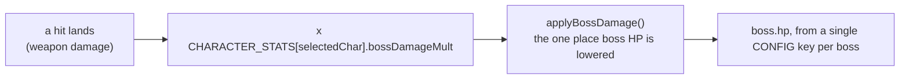

# Balance

What every character and every boss is worth, and the one rule that relates
them. See the [manual](manual.md#characters) for how each kit plays and
[Design patterns](design-patterns.md#one-dial-per-character-not-a-column-per-boss)
for why this shape was chosen over the per-character HP columns it replaced.

- [The rule](#the-rule)
- [Character stats](#character-stats)
- [Boss health](#boss-health)
- [What the multiplier does not touch](#what-the-multiplier-does-not-touch)
- [Time to kill](#time-to-kill)
- [Multiplayer](#multiplayer)

## The rule

Three independent facts, and nothing else:

1. **Every weapon has a damage.** How much one landed hit is worth before
   anyone is holding it. `arrowBossDamage`, `wizBoltDamage`,
   `knightSpearBossDamage`, and the rest of the `*BossDamage` keys in
   `CONFIG`.
2. **Every character has a multiplier.** `bossDamageMult` in
   `CHARACTER_STATS` (`src/sim/arena.ts`). One number, the whole of how hard
   that character hits.
3. **Every boss has one health pool.** `bossHP`, `darkArcherHP`,
   `darkKnightHP`, `commanderHP`. One number each, the same for everybody.

The multiplication happens once, in `applyBossDamage()`, which is already
documented as the single place boss health is lowered. Every weapon reaches
it through `damageBoss()`, and the fire burn reaches it directly, so a new
weapon is scaled by having damage at all rather than by remembering to scale
itself.

## Character stats

`CHARACTER_STATS` is `Record<CharacterKind, CharacterStats>`, one row per
hero, and the compiler refuses a row missing a field.

| Character | `maxHp` | `speed` | `bossDamageMult` |
|---|---|---|---|
| Knight | 12 | 150 | 1.5 |
| Archer | 9 | 200 | 1.4 |
| Sapper | 9 | 200 | 1.2 |
| Ranger | 8 | 250 | 0.8 |
| Wizard | 7 | 175 | 2.5 |

The shape of the roster, read down the columns:

- **The knight is the only one who has to be in contact to do anything**, so
  he carries the most health and the least speed. The extra hit point over
  everyone else is the whole reason the row exists.
- **The wizard hits hardest and dies fastest.** 2.5 is the highest multiplier
  and 7 is the lowest health, which is what "glass cannon" has to mean
  numerically for the panel to be telling the truth.
- **The ranger is fastest and weakest per hit**, and fires three bolts at
  once, so his multiplier is the only one below 1: the volley, not the bolt,
  is his unit of damage.
- **Archer and sapper share a body** and differ only in what they throw. That
  is deliberate — they are the two the rest of the roster is read against.

`maxHp` and `speed` are the base the FEATHERS upgrade tree stacks on, not the
final figure: `FEATHERS.maxHP()` and `FEATHERS.speed()` read the selected
character's row and then apply purchased levels on top. A knight who has
bought the health axis is still one point ahead of an archer who has bought
the same levels.

### The character-select panel

The panel's HP and SPEED bars are derived from this table, scaled against the
best row on the roster, so a stat cannot be advertised at a value the
simulation does not run on. RANGE and DAMAGE are authored per panel, because
neither summarises one number: an archer's range is his bow, his pickups and
a power-shot root together. `CHAR_PANELS` throws at load if an authored
DAMAGE bar disagrees with the ordering `bossDamageMult` gives, so the two
cannot drift apart silently even though they are written in two places.

This table is a second copy of those bars, so it is checked the same way:
`src/legacy/balance-doc.test.ts` parses it and compares every cell with what
`charPanels()` builds. The derived columns need that more than the authored
ones do — a pip is scaled against the roster's best row, so raising one
character's speed re-scales rows nobody edited, and the commit that breaks
this table never touches it.

| Character | RANGE | DAMAGE | HP | SPEED |
|---|---|---|---|---|
| Archer | 5 | 3 | 4 | 4 |
| Wizard | 4 | 5 | 3 | 4 |
| Knight | 1 | 3 | 5 | 3 |
| Ranger | 3 | 2 | 4 | 5 |
| Sapper | 2 | 3 | 4 | 4 |

## Boss health

One pool per boss, the same number whoever is fighting it.

| Boss | HP | Replaces |
|---|---|---|
| Crow King | 10 | `bossHP` 5 / `bossHPWizard` 14 / `bossHPKnight` 12 |
| Dark Archer | 12 | `darkArcherHP` 6 / 16 / 14 |
| Dark Knight | 16 | `darkKnightHP` 8 / 20 / 18 |
| Commander | 20 | `commanderHP` 10 / 24 / 22 |
| Minotaur | none | unchanged: he cannot be killed, and hits stun him instead |

Twelve hand-tuned numbers become four. The eight `*HPWizard` and `*HPKnight`
keys are deleted, and `bossHpFor()` loses the
`selectedChar === 'wizard' ? … : selectedChar === 'knight' ? … : …` chain
that read them.

## What the multiplier does not touch

`bossDamageMult` scales boss damage and nothing else. That is not a
simplification, it is the only place in single-player where damage is a
quantity rather than a threshold:

- **Crows, skeletons and rats have exactly 1 hit point.** They die to one hit
  of anything. Scaling a hit that already kills changes nothing, and scaling
  the ranger's below 1 would mean his bolts stop killing crows — the exact
  failure the net's 0.9 damage is designed around.
- **The player's own health** is `maxHp`, a different column.
- **Multiplayer** has no bosses. `BattleWorld` reads `speed` and `maxHp` from
  the same table and never looks at this field. See
  [Multiplayer](#multiplayer).

The name says the scope. A field called `damageMult` in a shared table would
invite exactly the wrong reading from the engine that has no bosses in it.

## Time to kill

Against the Crow King's 10, which is the fight every character sees first.

| Character | One action | Raw | x mult | Per action | Actions | Cadence |
|---|---|---|---|---|---|---|
| Knight | spear thrust, lands twice | 1 x 2 | 1.5 | 3.0 | 3.3 | 1.0 s, in contact |
| Wizard | one homing bolt | 1 | 2.5 | 2.5 | 4.0 | 1.2 s |
| Sapper | one powder charge | 2 | 1.2 | 2.4 | 4.2 | 1.1 s |
| Ranger | one volley of three bolts | 3 x 0.7 | 0.8 | 1.68 | 6.0 | click-limited |
| Archer | one arrow | 1 | 1.4 | 1.4 | 7.1 | click-limited |

The two click-limited kits take the most hits and land them fastest, which is
what "fastest shots, weakest hit" has to mean. The knight's three and a bit
swings are the shortest fight on paper and the longest in practice, because
every one of them needs him inside 80 px of a boss that orbits and charges.

What this changes against what shipped before it:

| Character | Was | Now | Why |
|---|---|---|---|
| Wizard | 14 bolts at 2.0 s, about 28 s of uninterrupted hits | 4 bolts at 1.2 s | The fight was not winnable. This is the whole reason the pass happened |
| Sapper | 3 charges | 4.2 | He had no column in the old matrix at all, so he fought the base pool with the second-highest damage in the game |
| Ranger | 2.4 volleys | 6.0 | Same fall-through: three bolts against a pool sized for one arrow |
| Archer | 5 arrows | 7.1 | The baseline moved; the fight is longer for everyone |
| Knight | 3 swings | 3.3 | Deliberately unchanged. His was the one column that was tuned |

`knightSpearBossDamage` drops from 2 to 1 as part of this. It still lands
twice per swing, so a swing is worth 2 rather than 4 — the only weapon whose
raw figure was four times the baseline arrow, which is precisely what the old
`bossHPKnight: 12` column existed to absorb.

`wizBoltCooldown` drops from 2.0 s to 1.2 s. That is a rate change, not a
damage one: the multiplier fixes what a bolt is worth, and the cooldown fixes
how long the wizard spends unable to answer anything. Note that bolts share
`maxArrowsInFlight` with arrows, which is 5 on the default `fast` preset and
3 on `calm`; at 1.2 s and a 3.5 s bolt lifetime, a `calm` wizard whose bolts
all miss can briefly cap out.

## Multiplayer

Multiplayer is balanced separately and stays that way. `BattleWorld` reads
`speed` and `maxHp` from `CHARACTER_STATS`, so the roster's bodies are shared,
but its damage numbers are designed in `src/sim/weapons.ts` against a flat 10
health, per-weapon, each with its reasoning written next to the constant:
`ARROW_DAMAGE` 2, `BOLT_DAMAGE` 3, `SPEAR_DAMAGE` 2 twice,
`CROSSBOW_BOLT_DAMAGE` 0.7 three times, `SAPPER_CHARGE_DAMAGE` 2.

Those figures are already coherent, and applying a multiplier tuned against
boss pools on top of them would not improve anything: a 0.7 crossbow bolt
scaled by the ranger's 0.8 rounds toward nothing, and a 3-damage bolt scaled
by the wizard's 2.5 is a two-shot kill out of 10 health. The single dial
answers a question multiplayer does not ask.

The bodies do change there. A 12-health knight and a 7-health wizard in a
deathmatch are a real balance shift, arriving from the same table, and it is
the first time the two engines have disagreed about anything other than
damage.

## See also

- [Design patterns](design-patterns.md#one-dial-per-character-not-a-column-per-boss): the decision, and the alternative that lost
- [Manual](manual.md#characters): every kit in full
- [Architecture](architecture.md#object-composition): every table keyed on `CharacterKind`
