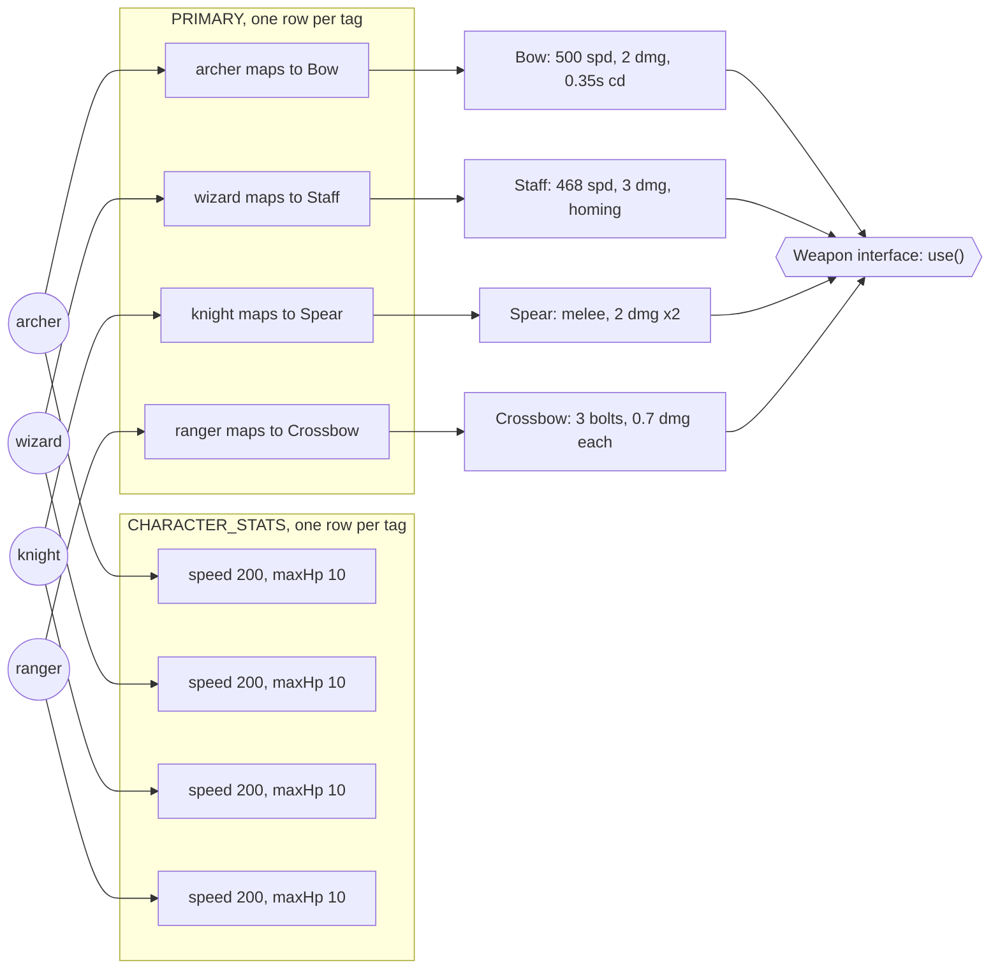
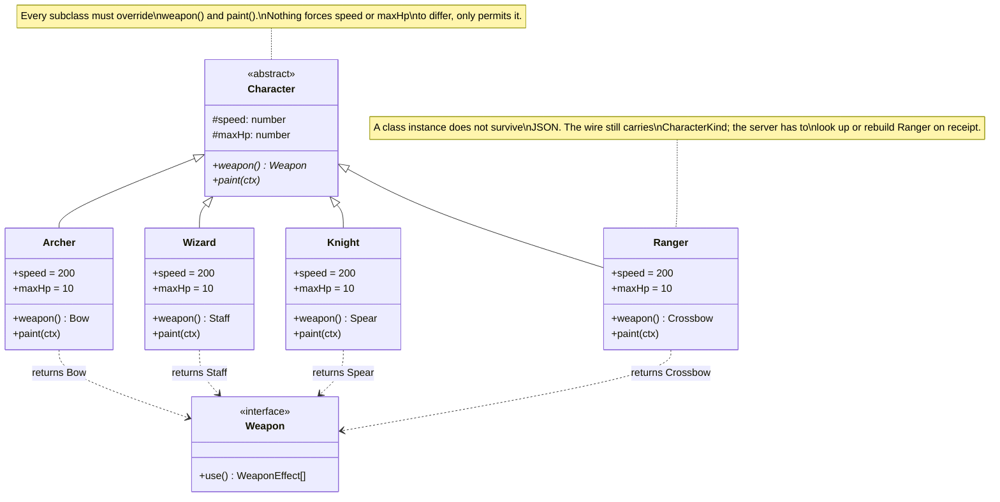
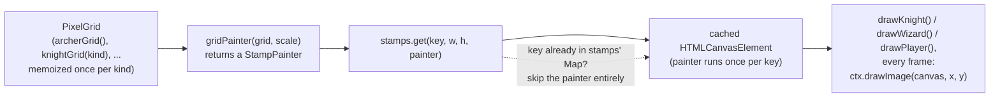

# Design patterns

Why the code in this project is shaped the way it is, through worked examples
from the actual codebase. Each entry below is a real decision, with the
alternative that was considered and the reason it lost. This is not a general
pattern reference: every claim points at a real file.

## Composition over inheritance: character definition

Crow Archer has five playable characters today, archer, wizard, knight,
ranger, and sapper. A character's identity is a plain string tag. Behavior attaches to
that tag from the outside, through lookup tables, rather than living on a
class that the tag is an instance of.

### Building blocks

| Name | Type | Holds |
|---|---|---|
| `CharacterKind` | `'archer' \| 'wizard' \| 'knight' \| 'ranger' \| 'sapper'` | The tag itself. No fields, no methods. |
| `CHARACTERS` | `readonly CharacterKind[]` | The one array both the union and the runtime validator check against. |
| `PRIMARY` | `Record<CharacterKind, () => Weapon>` | Which weapon a character fights with. |
| `SILHOUETTES` | `Record<CharacterKind, Silhouette>` | Shadow and halo geometry for the body. |
| `PAINTERS` | `Record<CharacterKind, (ctx, pose) => void>` | The draw routine. |

- `CharacterKind` is defined at `src/net/protocol.ts`. It crosses the
  network in the `SET_CHARACTER` message, so it needs a runtime check as well
  as a compile time type.
- `CHARACTERS` is defined at `src/net/protocol.ts` and is the source both
  the type and `isCharacter()` (`protocol.ts`) check against, so the
  valid set is written once.
- `PRIMARY` is defined at `src/sim/weapons.ts`. `primaryWeapon('wizard')`
  returns a `new Staff()`.
- `SILHOUETTES` is defined at `src/render/characters.ts`. Each entry is a
  plain object, `shadowY`, `shadowRX`, `shadowRY`, `haloY`, `haloR`, sized so
  a halo drawn for the archer does not sit inside the knight's breastplate.
- `PAINTERS` is defined at `src/render/characters.ts`. Each entry is the
  function that draws that character's body for one frame.

### How it works



A tag carries no behavior. A fifth character would be a new circle, one new
row in each table, and one new class implementing `Weapon`. Nothing that
already works gets edited: this is exactly the shape `ranger` landed in.
TypeScript enforces the completeness: widen the `CharacterKind` union and
every `Record<CharacterKind, X>` refuses to compile until the new tag has a
row everywhere.

### The alternative considered

The more classical object-oriented answer to "shared behavior, per-type
specifics" is a base class with overriding subclasses. It was considered and
rejected for this project.



Under this shape, `Ranger` has to exist as a class and implement every
abstract member before the game compiles, whether or not its stats or paint
routine actually differ from the others.

### Why composition wins here

- **The differences are data, not algorithm.** A speed number, an HP number,
  a `Silhouette` record, a `Weapon` instance from a factory. Movement,
  collision, and damage resolution run through one path for every character,
  in `src/sim/battle-world.ts` and `src/sim/collide.ts`. Inheritance earns
  its keep when a subclass overrides how something is computed. When it only
  supplies different constants, a table is less machinery for the same
  result.
- **The player crosses the wire and gets replayed.** Every tick the server
  packs a player's state into one number (`packPlayerState`,
  `src/net/entity-state.ts`), the client unpacks it, and client side
  prediction rewinds and replays a plain record on every reconciliation. A
  `CharacterKind` string survives that for free. A class instance does not:
  JSON does not revive a class, so a `Ranger` instance would need to be
  reconstructed from wire data on every receipt.
- **Consistency.** `PRIMARY`, `SILHOUETTES`, and `PAINTERS` already use this
  shape. Splitting stats onto a base class while everything else stays table
  driven means a new hero is added in two different kinds of places for one
  concept. The same idiom recurs independently for pickups: `EFFECTS` in
  `src/sim/pickups.ts` is a `Record<PickupKind, (target: Empowerable) =>
  void>` for the same reason.

### Example: adding a hero

The fourth hero landed for real, and turned out to be exactly this shape: a
`ranger` with a `Crossbow` (`src/sim/weapons.ts`), one new class implementing
`Weapon`, plus one row each in `PRIMARY`, `SILHOUETTES`
(`src/render/characters.ts`), and `PAINTERS`. Nothing existing was edited to
add it, only extended.

The fifth, the `sapper`, was the same shape again, and this time the claim was
measured rather than assumed: widening `CharacterKind` alone and running
`npm run typecheck` produced exactly five errors, one per table
(`SILHOUETTES`, `PAINTERS`, `CHARACTER_STATS`, `PRIMARY`, `CHARACTER_KEYS`),
and nothing else in the codebase failed to compile. Its weapon, `PowderCharge`,
is one new class whose shot is `flavour: 'dynamite'`, so it inherits the
bounce, fuse and blast the world already runs — a new hero, not a new
mechanic. Its `OWN_SECONDARY` row is the first to answer `{ kind: 'none' }`
deliberately: an explosive primary does not want the dynamite fallback.

The legacy single-player side is not table-driven the same way, and adding a
hero there is a dispatch line in `tryShoot`/`drawPlayer` plus rows in
`CHAR_PANELS`, `LANE_B`, `LANE_D` and `RETICLE_PAINTERS`. That asymmetry is
the honest measure of what the composition pattern buys on the TS side.

### Notes

> **Note.** The three gaps identified alongside this decision are now built.
> `CHARACTER_STATS: Record<CharacterKind, { speed: number; maxHp: number }>`
> lives in `src/sim/arena.ts`, consumed by `BattleWorld`'s movement and
> respawn; every row is still the shared 200/10 today, since no hero has
> asked to differ yet. `secondaryWeapon(character, mode)` in
> `src/sim/weapons.ts` replaced the `carriesDynamite` special case: it
> returns an exhaustive `Secondary` union (`none | dynamite | satchel`), and
> the ranger's own secondary, the satchel, is one of its two real branches
> rather than a further special case. `src/ui/lobby-controller.ts`'s
> `CHARACTER_KEYS: Record<CharacterKind, string>` replaced the hand written
> `charMap`; the ranger is bound to `x` (`r` was already claimed by the
> lobby's ready-toggle) and the compiler would have refused to build without
> that line at all. Full account of what the ranger added: `ROADMAP.md`,
> decision 7.

## Cache canvas primitives once: reuse the paint cache, don't build a new one

Pixel-art character sprites (`src/legacy/game.js`) are small logical grids,
one hex color or `null` per cell, hand-authored once per character and
blitted onto the real canvas every frame. The naive way to blit one is to
walk every cell and call `ctx.fillRect` on each filled one. That's cheap for
a single entity, but the pixel-art work is explicitly headed toward many
more sprite kinds (crows, three skeleton kinds, three bosses), several of
which appear concurrently on screen during castle waves. Re-walking every
cell of every visible sprite, every frame, forever, is the kind of cost that
is invisible with three sprites and real with a dozen.

The fix is not a new cache. `src/render/stamps.ts` already has one.

### Building blocks

| Name | Type | Holds |
|---|---|---|
| `StampCache` | class | A canvas cached by string key, built once from a paint callback. |
| `stamps` | `StampCache` singleton | The one shared instance every caller uses. |
| `StampPainter` | `(g, w, h) => void` | The paint routine a cache entry is built from. Knows nothing about what it draws. |
| `PixelGrid` | `readonly (string \| null)[][]` | A sprite's logical pixel data, one hex color or `null` per cell. |
| `gridPainter` / `gridFlashPainter` | `(grid, scale) => StampPainter` | Adapts a `PixelGrid` into a `StampPainter`: real colors, or a flat single-color silhouette for hit-flash. |
| `spriteCanvas` / `spriteFlashCanvas` | `(key, grid, w, h, ...) => HTMLCanvasElement` | The public entry point: the cached canvas for one sprite kind. |

- `StampCache`, `stamps`, `StampPainter` are defined at `src/render/stamps.ts-30`,
  built for a different problem first: `glowDotStamp`/`glowRectStamp` cache
  pre-rendered glow effects the same way, keyed by `` `dot|${color}|${r}|${blur}` ``.
- `PixelGrid`, `gridPainter`, `gridFlashPainter`, `spriteCanvas`, and
  `spriteFlashCanvas` are defined in `src/render/pixel-sprite.ts`, the only
  new file this decision added.
- Consumed by every sprite kind today, all in `src/legacy/game.js`: the four
  heroes (wizard `:3312-3313`, archer `:3413-3414`, ranger `:3620-3621`,
  knight `:3721`), crow (`:4193-4194`), skeleton (`:4314-4315`), and the
  three bosses (`:4616`, `:4719`, `:4856`). Each still owns its own grid
  builder and memoized grid (`archerGrid()`, `knightGrid(kind)`, ...). Only
  the blit-to-canvas step changed.

### How it works



### The alternative considered

Two other shapes were built out, in conversation, before this one:

1. **Patch `drawPixelSprite` in place.** Keep each character's existing
   per-pixel loop, but cache a rendered canvas alongside its already-cached
   grid (`_archerGrid`, `_knightGrids`). Rejected: it doesn't remove the
   duplication it should, it grows it. Every future sprite kind still needs
   its own hand-wired cache, wired correctly, by hand, every time.
2. **A dedicated `PixelSprite` / `SpriteCache` abstraction**, built fresh for
   this problem: a class or factory that owns a grid, renders it once to an
   offscreen canvas, and exposes a single `draw()`. Structurally better than
   (1), but rejected once `stamps.ts` was actually read: `StampCache`
   already is this abstraction. It was built for glow stamps, but its
   `get(key, w, h, painter)` signature never assumed what the painter draws.
   Writing a second cache under a new name would have duplicated proven
   infrastructure instead of reusing it.

### Why reuse wins here

- **The only real difference is the painter, not the caching.** A glow dot
  and a pixel grid are both just "some drawing calls into a 2D context, run
  once, cached by key." Once that's noticed, a second cache class has
  nothing left to justify it.
- **Consistency.** `game.js` already imports three things from
  `src/render/*.ts` (`tiles.ts`, `shake.ts`, `stamps.ts`) before this change.
  Crossing that boundary for a fourth is not a new pattern, it's the same
  one applied one more time.
- **The payoff outside this file is concrete, not speculative.** The TS
  multiplayer renderer (`src/render/characters.ts`) has no pixel art yet,
  but is pending work, not a hypothetical. When it lands, it can import
  `spriteCanvas` directly instead of porting anything, since the cache never
  lived inside `game.js` to begin with.
- **Hit-flash reuses the mechanism instead of special-casing it.**
  `spriteFlashCanvas` is a second cached canvas per key
  (`` `${key}|flash|${color}` ``), painted once with every cell forced to one
  color. Same `stamps.get`, a different painter: not a second code path.

### Example: adding a sprite kind

Crow and skeleton pixel art landed the same way: one call site each, nothing
about `stamps` or `pixel-sprite.ts` touched.

```js
// src/legacy/game.js
: spriteCanvas(`crow|${kind}|${frame}`, grid, CROW_SPRITE.w, CROW_SPRITE.h);
```

No new cache variable, no new class, no file to remember to touch.
`SKELETON_PALETTES`-style kind variants key the same way the knight already
does: `` spriteCanvas(`skeleton|${kind}`, ...) ``.

### Notes

> **Note.** This decision was reached while investigating a performance
> question, not a bug: pixel-art sprites for Archer/Wizard/Knight were
> re-walking their full grid with `fillRect` every frame, which is fine for
> one on-screen hero but would not have stayed fine once castle waves put
> several skeletons on screen at once, each doing the same. The fix landed
> as a migration of the three existing heroes onto `spriteCanvas`/
> `spriteFlashCanvas`, with the now-unused per-frame loop
> (`drawPixelSprite`/`drawPixelSpriteFlash`) deleted rather than kept
> alongside it.

## Diagnosing a human's bug report: a second stream over the same events, not a second event system

A player says "the game went back to the menu and I don't know why." Before
this decision there was nothing to check: no record of what actually
happened, in what order, right before it went wrong — only guessing, then
re-simulating a few hundred plausible seeds and key sequences hoping one of
them reproduces it. That does not scale, and it is not evidence even when it
works: it proves *a* bug is reachable, not that it is *the* bug that was
reported.

The obvious first question — does `EventBus`/`GameEvent`
(`src/sim/events.ts`) already do this? — has a clear no. That system is
built for a different job: a closed union of gameplay *facts*
(`CROW_KILLED`, `BOSS_HIT`, `MAP_GENERATED`, ...) that the render/audio layer
reacts to, with no level, no timestamp, no history — `emit()` fans out
synchronously and nothing is kept. Widening that union with a `LOG_MESSAGE`
variant for arbitrary debug strings would be the "second list to keep in
sync" failure this file's other entries specifically avoid, applied to a
type that was never meant to hold freeform text in the first place.

### Building blocks

| Name | Type | Holds |
|---|---|---|
| `LogLevel` | `'debug' \| 'info' \| 'warn' \| 'error'` | The floor a call is checked against before anything is built. |
| `LogEvent` | interface | `id`, `level`, `timestamp`, `source`, `message`, optional `code`, optional `data`. |
| `Logger` | class | One bounded ring buffer, one level, one console-mirroring threshold. |
| `log` | `Logger` singleton | The one shared instance every call site imports. |
| `attachToEvents` | `(logger, bus) => unsubscribe` | Folds an `EventBus`'s gameplay events into a logger as debug entries. |

- `LogLevel`, `LogEvent`, `Logger` are defined in `src/sim/log.ts`.
- `log`, the singleton, is exported from the same file and mirrors `stamps`
  in `src/render/stamps.ts` — one instance, imported wherever it's needed,
  never reconstructed per call site.
- `attachToEvents` is the seam to the existing system: called once, at
  module scope in `game.js` right next to `const events = new EventBus()`,
  not inside `boot()` — subscribing has no DOM dependency, so unlike the
  rest of `boot()` it doesn't need to wait for one.

### How it works

```mermaid
flowchart LR
    call["log.info('transitionTo', 'menu -> charselect', {...})"]
    gate{"level >= floor?"}
    drop(["dropped — one comparison, no allocation"])
    ring["ring buffer\n(oldest drops past capacity)"]
    console["console.log/warn/error\n(if >= consoleLevel)"]

    call --> gate
    gate -- no --> drop
    gate -- yes --> ring
    ring --> console

    bus["events.emit(gameplayFact)"]
    attach["attachToEvents subscription"]
    bus --> attach --> call
```

A disabled call — the default in real play, floor at `'warn'` — costs
exactly the `level >= floor` comparison in `record()`; the `LogEvent` object
is never built. An enabled one is recorded once, unconditionally, and
mirrored to `console` only if it also clears the separate `consoleLevel`
threshold, so the ring buffer can hold more than a human watching DevTools
needs to see scroll past.

### The alternative considered

Route diagnostics through `EventBus` itself: add a `type: 'LOG'` variant
carrying `level`/`message`/`data`, and have `game.js` call `events.emit(...)`
everywhere a `log.*()` call would otherwise go. Rejected for the reason
above — `GameEvent` is typed as a closed set of specific gameplay facts
precisely so a render handler's `switch` can be exhaustive over it. A
`LOG` variant with a freeform `message: string` payload defeats that: every
future gameplay-fact variant added for a real reason would sit in the same
union as an admin's ad-hoc debug string, and the render layer would need to
either ignore `LOG` explicitly (a case that means nothing to it) or the
switch stops being exhaustive over what actually matters to drawing.

### Why the seam wins here

- **The two systems answer different questions.** `GameEvent` answers "what
  happened that a player should see or hear." The logger answers "what
  happened that a developer needs to reconstruct, in order, after the
  fact." Forcing one shape to answer both questions is the same mistake the
  rejected class hierarchy for characters would have been: two genuinely
  different concerns sharing one type because they both involve "something
  happened."
- **Reuse still happens, at the one seam that's actually the same shape.**
  Every `GameEvent` already carries what a render handler needs; folding it
  into the log via `attachToEvents` costs one subscription, not a rewrite of
  every `emit()` call site. That is the reuse this file's other entries ask
  for, applied where the shapes genuinely match rather than forced where
  they don't.
- **Performance was a stated constraint, not an afterthought.** A game loop
  runs at 60Hz; a logging call inside `updatePlayer` or `updateCrows` that
  always allocated would be a real, measurable cost. The level gate is
  checked first and returns before any object is built, so the "off"
  state — the default during real play — is a single comparison per call,
  the same reasoning `spriteCanvas`'s cache-by-key has for why the blit
  loop the previous section replaced was worth replacing.

### Example: instrumenting a call site

`transitionTo()` in `game.js` was the first real one, chosen because it's
exactly the shape of evidence a "the game did something I didn't expect"
report needs:

```js
// src/legacy/game.js
function transitionTo(next) {
  if (next === 'controls') controlsFrom = appState;
  const prev = appState;
  appState = next;
  if (prev !== next) log.info('transitionTo', `${prev} -> ${next}`, { prev, next, gameMode, mapKind });
  ...
```

A future call site follows the same shape: `log.debug(sourceFnName,
message, data)` for anything routine, `log.warn`/`log.error` for anything
that shouldn't happen, `code` on the `error()` call when the failure is
common enough to deserve a stable, greppable tag rather than only a
sentence.

### Notes

> **Note.** `devHooks.logs()` returns a snapshot (`Logger.events()` copies
> the ring buffer, so it is safe to hold onto after the call).
> `devHooks.setLogLevel(level)` and `devHooks.clearLogs()` round out the
> harness surface. `?log=debug` (or `info`/`warn`/`error`) on the URL sets
> the level at boot for a human testing session without touching devtools
> at all. Capacity defaults to 500 events; oldest drops first once a
> session runs long, so memory stays bounded without anyone having to
> remember to call `clear()`.
