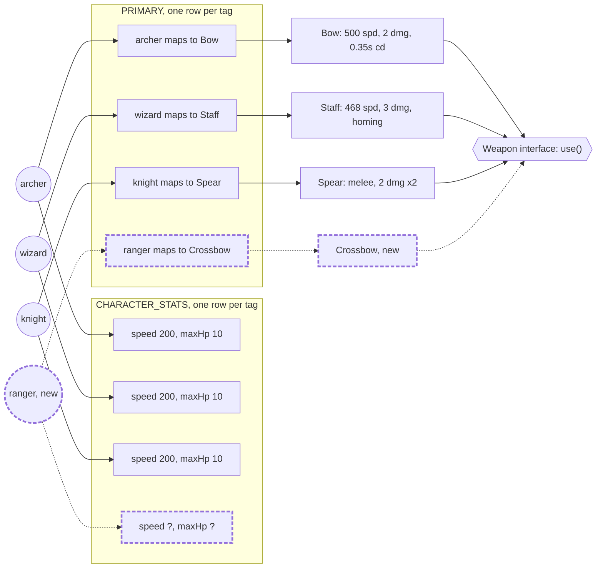
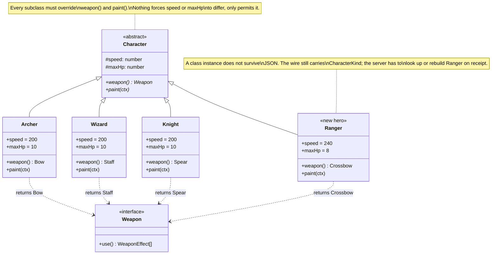

# Design patterns

Why the code in this project is shaped the way it is, through worked examples
from the actual codebase. Each entry below is a real decision, with the
alternative that was considered and the reason it lost. This is not a general
pattern reference: every claim points at a real file.

## Composition over inheritance: character definition

Crow Archer has three playable characters today, archer, wizard, and knight,
and is built to take a fourth. A character's identity is a plain string tag.
Behavior attaches to that tag from the outside, through lookup tables, rather
than living on a class that the tag is an instance of.

### Building blocks

| Name | Type | Holds |
|---|---|---|
| `CharacterKind` | `'archer' \| 'wizard' \| 'knight'` | The tag itself. No fields, no methods. |
| `CHARACTERS` | `readonly CharacterKind[]` | The one array both the union and the runtime validator check against. |
| `PRIMARY` | `Record<CharacterKind, () => Weapon>` | Which weapon a character fights with. |
| `SILHOUETTES` | `Record<CharacterKind, Silhouette>` | Shadow and halo geometry for the body. |
| `PAINTERS` | `Record<CharacterKind, (ctx, pose) => void>` | The draw routine. |

- `CharacterKind` is defined at `src/net/protocol.ts:64`. It crosses the
  network in the `SET_CHARACTER` message, so it needs a runtime check as well
  as a compile time type.
- `CHARACTERS` is defined at `src/net/protocol.ts:376` and is the source both
  the type and `isCharacter()` (`protocol.ts:403`) check against, so the
  valid set is written once.
- `PRIMARY` is defined at `src/sim/weapons.ts:306`. `primaryWeapon('wizard')`
  returns a `new Staff()`.
- `SILHOUETTES` is defined at `src/render/characters.ts:131`. Each entry is a
  plain object, `shadowY`, `shadowRX`, `shadowRY`, `haloY`, `haloR`, sized so
  a halo drawn for the archer does not sit inside the knight's breastplate.
- `PAINTERS` is defined at `src/render/characters.ts:208`. Each entry is the
  function that draws that character's body for one frame.

### How it works

A tag carries no behavior. Adding `ranger` is a new circle, one new row in
each table, and one new class implementing `Weapon`. Nothing that already
works gets edited. TypeScript enforces the completeness: widen the
`CharacterKind` union and every `Record<CharacterKind, X>` refuses to compile
until it has a `ranger` row.

### The alternative considered

The more classical object-oriented answer to "shared behavior, per-type
specifics" is a base class with overriding subclasses. It was considered and
rejected for this project.

Under this shape, `Ranger` has to exist as a class and implement every
abstract member before the game compiles, whether or not its stats or paint
routine actually differ from the others.

### Why composition wins here

- **The differences are data, not algorithm.** A speed number, an HP number,
  a `Silhouette` record, a `Weapon` instance from a factory. Movement,
  collision, and damage resolution run through one path for every character,
  in `src/sim/battle-world.ts` and `src/sim/collide.ts`. Inheritance earns
  its keep when a subclass overrides how something is computed. When it only
  supplies different constants, a table is less machinery for the same
  result.
- **The player crosses the wire and gets replayed.** Every tick the server
  packs a player's state into one number (`packPlayerState`,
  `src/net/entity-state.ts:52`), the client unpacks it, and client side
  prediction rewinds and replays a plain record on every reconciliation. A
  `CharacterKind` string survives that for free. A class instance does not:
  JSON does not revive a class, so a `Ranger` instance would need to be
  reconstructed from wire data on every receipt.
- **Consistency.** `PRIMARY`, `SILHOUETTES`, and `PAINTERS` already use this
  shape. Splitting stats onto a base class while everything else stays table
  driven means a new hero is added in two different kinds of places for one
  concept. The same idiom recurs independently for pickups: `EFFECTS` in
  `src/sim/pickups.ts:44` is a `Record<PickupKind, (target: Empowerable) =>
  void>` for the same reason.

### Example: adding a hero

The fourth hero landed for real, and turned out to be exactly this shape: a
`ranger` with a `Crossbow` (`src/sim/weapons.ts`), one new class implementing
`Weapon`, plus one row each in `PRIMARY`, `SILHOUETTES`
(`src/render/characters.ts`), and `PAINTERS`. Nothing existing was edited to
add it, only extended.

### Notes

> **Note.** The three gaps identified alongside this decision are now built.
> `CHARACTER_STATS: Record<CharacterKind, { speed: number; maxHp: number }>`
> lives in `src/sim/arena.ts`, consumed by `BattleWorld`'s movement and
> respawn; every row is still the shared 200/10 today, since no hero has
> asked to differ yet. `secondaryWeapon(character, mode)` in
> `src/sim/weapons.ts` replaced the `carriesDynamite` special case: it
> returns an exhaustive `Secondary` union (`none | dynamite | satchel`), and
> the ranger's own secondary, the satchel, is one of its two real branches
> rather than a further special case. `src/ui/lobby-controller.ts`'s
> `CHARACTER_KEYS: Record<CharacterKind, string>` replaced the hand written
> `charMap`; the ranger is bound to `x` (`r` was already claimed by the
> lobby's ready-toggle) and the compiler would have refused to build without
> that line at all. Full account of what the ranger added: `ROADMAP.md`,
> decision 7.
