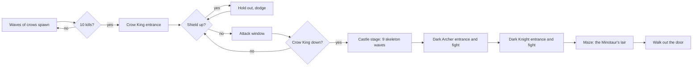
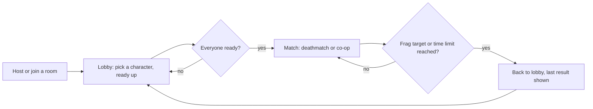

# Game manual

Full mechanics reference. See the [README](../README.md) for the quick start.

- [Characters](#characters)
- [Game loop](#game-loop)
- [Systems](#systems)
- [Map](#map)
- [Bosses](#bosses)
- [Multiplayer](#multiplayer)

## Characters

### Archer
Classic ranged fighter. Mouse-aimed arrows with a dotted aim line.
- **Primary:** Arrows, quiver of 10, refilled by pickups
- **Special:** Dynamite, hold to charge, release to throw, blast clears tiles and damages the boss
- **Power shot (hold Shift):** Draws the bow, rooted while he holds it, for up to 1 s. Releasing looses one arrow that pierces up to 3 bodies, flies at up to twice the usual 500 px/s, and hits a boss for up to 3x a plain arrow. A tap gets the bottom of every one of those ranges, so the question the key asks is how long to stand still. 5 s cooldown. It spends one unit of whatever ammo is queued, so a fully drawn fire arrow still burns, and it ignores the in-flight cap
- **Pickups:** Ricochet arrows (bounce off walls with a speed boost), fire arrows (leave burning patches)

### Wizard
Teleguided magic with area control.
- **Primary:** Magic bolts, 3 s cooldown, home toward the nearest enemy, disappear on contact
- **Blink (tap Shift):** Steps 160 px down the aim line, instantly, and ignores damage for 0.3 s on arrival. 6 s cooldown. It never crosses a wall: it walks the aim in short steps and stops at the last point the body fits, so it closes on cover rather than passing through it. A blink with nowhere to go is refused outright and costs no cooldown
- **Blink chain:** Tap Shift again within 1.1 s of the first hop and the second one is free, ignoring the cooldown the first started. Two hops is the cap. The window is the only thing that carries it: let it lapse and you are back to waiting out the 6 s. A hop with nowhere to go is refused without spending the chain, so a wall in front of you costs nothing but the press
- **Arrival pulse:** Every hop lets off a 56 px pulse where it lands, killing what is in it and taking 1 off a boss. A ring is drawn at exactly the radius the damage used, so what you see is a report of what was hit rather than a decoration
- **Special:** Lightning Storm, 450 px AoE around the player, destroys ROCK, TREE and HUT tiles, damages all enemies
- **Pickups:** Fire bolt (2x damage), laser stream (passes through walls, stops on the first enemy)

The wizard has no sniper mode. Bolts steer themselves onto a target after they
are cast, so a tighter angle at the moment of casting buys almost nothing while
the root it comes with costs everything — the same reasoning that gave the
knight his charge on the same key.

### Knight
Frontline melee with a long spear.
- **Primary:** Spear thrust, 80 px reach along the aim line, 1.5 s cooldown, 1 damage to boss
- **Charge (hold Shift):** Winds up in place for up to 3 s, taking no damage while he holds it. Releasing sends him forward at half speed for 1.5 s, sweeping a 45 degree arc 90 px in front. Anything caught in the arc dies outright; the boss takes 1.3x the spear's damage on an instant release, up to 2x at a full hold, once per charge. The invulnerability ends the moment he starts moving. 4 s cooldown
- **Charge chain (tap Shift again):** Within 1.1 s of releasing, and with room left ahead, a second tap commits him harder: the dash goes from half speed to a little over walking pace for the rest of its run, and he lands one whirlwind swing, 60 px, where he is standing. Once per dash. He cannot steer with it — the angle was fixed at release and stays fixed — so the chain buys speed along a line already chosen, not a new one
- **Special:** Block, passive with no keybind. Banks one absorbed hit, then recharges 10 s after that hit is spent
- **Tool:** Whirlwind, 3-second spinning AoE (72 px radius), damages enemies and destroys ROCK, TREE and HUT tiles, 8 s cooldown
- **Pickups:** Iron Javelin (thrown piercing spear, 2 pierce charges, 3 per pickup), Fire Sword (2x damage and range for 8 s, leaves burning patches)

### Ranger
Skirmisher with a rapid-fire crossbow.
- **Primary:** Crossbow, same quiver of 10 as the archer's. One press fires 3 independent bolts in a narrow spread, each 30% smaller and 30% weaker than an arrow
- **Special:** Satchel, first click throws it inert, second click arms a 3 s fuse shown as a countdown on the bag; the ranger's own bolt sets it off instantly, armed or not
- **Pickups:** Ricochet bolts (bounce off walls with a speed boost), fire bolts (leave burning patches). Both are the archer's own pickup effects, unchanged

### Sapper
Demolition. The only hero whose opening move is thrown at a place rather than at a person.
- **Primary:** Powder charge, 1.1 s cooldown. The archer's own throw, uncharged: it bounces off cover, runs a 1.5 s fuse, and blows up where it stops. The blast damages everything in radius and clears ROCK, TREE and HUT tiles
- **Ammo:** none. Charges are made on the spot, so the cooldown is the whole limit and there is no quiver to run dry, no pickup to chase, and no pitchfork fallback
- **Special:** none, deliberately. The primary is already the explosive
- **Reticle:** the only one that shows an area — a dashed ring at the blast radius, so you can see what the charge will reach and how near that is to your own feet

## Game loop

### Single-player



Crow King shield phases:
- First 10 s: blue rotating shield, fully immune
- 5 s open window: attack freely
- Randomly re-shields for 5 s (purple ring), up to 3 times per 30-second window

The Crow King's death loads the castle map and starts a nine-wave gauntlet,
three waves each of three skeleton kinds, sized 3 then 4 then 5 within each
kind so every new threat starts light and ends heavy:

| Waves | Kind | Behavior |
|---|---|---|
| 1-3 | Normal | Walks straight at you, one contact hit |
| 4-6 | Fire | Same approach, explodes for 1 damage in a 50px radius on death |
| 7-9 | Ice | Same approach, plus one ice bolt every 3 s aimed at you: 1 damage and a 3-second freeze that locks out all movement, aiming and attacks on a hit |

There is no kill target. Clearing a wave's last skeleton starts the next
one; clearing wave 9 starts the Dark Archer's entrance. Both dark bosses
skip the Crow King's shield entirely, every hit lands. The dark archer
keeps its distance, firing three-bolt volleys and lobbing an occasional
bomb that explodes in a radius; the dark knight closes the gap fast,
charging often and sometimes halting into a whirlwind between charges.
Both summon one skeleton every so often too, ice from the archer and fire
from the knight. Beating both does not end the run: the castle floor opens
into the labyrinth under it, behind a black screen reading YOU HAVE ENTERED THE
MINOTAUR'S LAIR.

### The maze

The third and last level. You do not clear it, you leave it.

It is dark. You see four tiles, about one junction ahead. Corridors you have
walked stay dimly on screen; everything else is black, and enemies only draw
where you can see them right now, so memory shows you walls and never what is
moving between them. Four torches are hidden in the level. Press **E** on one
and it lights permanently, tripling sight to twelve tiles. The first torch is
the whole upgrade, so the others are for reading the map, not for stacking.

The **Minotaur** cannot be killed. Hitting him stuns him, which buys you
distance and never progress. He hunts you the whole level, charges when he sees
you down a corridor, and smashes the wall he ends against. Maze walls are
otherwise indestructible: dynamite, Lightning Storm and Whirlwind still damage
what is in radius, they just do not open the level up.

The way out is a chain:

| Step | How |
|---|---|
| Silver key | Dropped by a rat, one roll in five, and only after you have met the Minotaur |
| Chest | Walk onto it holding the silver key |
| Golden key | Inside the chest |
| Door | Walk onto it holding the golden key. This wins the run |

"Met the Minotaur" means his first charge or his first stun, whichever lands
first. Before that, rats drop nothing. One silver key exists per run.

**Rats** die to anything and come in packs. The bite is 1 damage, and then 3
more over three seconds while you move at 65% speed. One bite is survivable.
Being swarmed while slowed is how the level kills you.

Difficulty is set per character, easiest first: ranger, archer, knight, sapper, wizard.
The knight is strongest here, because melee answers a pack fastest, so the maze
sends him the most rats and the least patient Minotaur.

### Multiplayer

No boss, and no win screen of its own: a match ends back at the lobby, showing
whatever it was decided on.



## Systems

| Module | Description |
|--------|-------------|
| **FORESHADOW** | Sky tint darkens and banners appear at kill milestones leading up to the boss |
| **STREAK** | Announcer chain: Double Kill, Multi Kill, Mega Kill, Ultra Kill, Monster Kill |
| **FEATHERS** | Meta-currency earned from kills, persisted in `localStorage`. Spend on the upgrade tree (`src/sim/upgrades.ts`) in the inventory screen: arrow capacity, HP, pitchfork range, move speed, tool capacity, arrows per pickup, a feather bounty, and a shield on every run |
| **HANDICAP** | `CONFIG.handicap` (0 to 100) rubber-bands crow speed and drop rate for accessibility |
| **BOUNTIES** | Two active micro-objectives tied to kill streaks, bonus rewards on completion |

## Map

- 33 x 21 procedural tile grid (EMPTY, ROCK, WATER, TREE, ASH, HUT)
- Player spawns in a guaranteed clear zone, crows enter from the right corridor
- Trees burn to ash on boss arrival, opening the arena
- Dynamite, Lightning Storm and Whirlwind destroy ROCK, TREE and HUT tiles permanently
- Two themes, forest and castle. Same tile grid and the same rules (ROCK
  still blocks shots and movement, WATER still stops you but not arrows),
  different art: stone floor and walls, pillars instead of boulders and
  trees. Single-player's castle stage always uses it; multiplayer's host
  picks either one for the match

## Bosses

| | Movement | Attack | Shield |
|---|---|---|---|
| **Crow King** | Orbits the player, charges periodically | Screeches to aggro white crows, summons bats | Three phases, see [Game loop](#game-loop) |
| **Dark Archer** | Orbits at range, never closes in | Three-bolt volley, an occasional lobbed bomb, and a summoned ice skeleton | None, every hit lands |
| **Dark Knight** | Short lead-in, then charges often, sometimes halting into a whirlwind | Higher contact damage than the Crow King's charge, plus a summoned fire skeleton | None, every hit lands |
| **Minotaur** | Hunts you through the maze, charges on sight, smashes the wall he hits | Contact, and more of it mid-charge | None, and no HP: hits stun him instead of hurting him |

The two dark bosses are corrupted echoes of the Archer and the Knight: the
archer's silhouette keeps a bow drawn on you, the knight's keeps a spear that
extends on each charge. Fire weapons still ignite either of them the way
they ignite the Crow King.

## Multiplayer

Up to four players in a room, co-op or 2v2. The server runs the only simulation; each client predicts its own movement so your body answers the keyboard without waiting for a round trip, and draws everyone else 100 ms in the past so they move smoothly.

Every match uses a fresh generated map built on both machines from the four-byte seed rather than sent over the wire. Terrain stops you and stops arrows; water stops you but not arrows; dynamite burns a hut down to ash you can then walk over. The host picks which of the two themes, forest or castle, before starting; see [Map](#map).

Everyone starts behind a **shield**, which absorbs one hit of any size and comes back when you respawn. Any hit also grants a third of a second of immunity, so a volley cannot delete you and a spear cannot count as five hits.

Every character carries their own second weapon, in any mode. **Dynamite** is the archer's: four sticks, a 1.5 second fuse, and it never catches you or your team. The **satchel** is the ranger's: thrown inert with one click, armed by a second click that starts a three-second countdown, and the ranger's own bolt sets it off on contact whether it is armed yet or not. The **sapper** is the exception and carries nothing at all on the second button: a powder charge is already what the primary throws, so a second explosive would be the same press twice. The wizard's **Lightning Storm** and the knight's **Whirlwind** land instantly and over a 3-second channel respectively, hit everyone in range at once, and clear rock, trees and huts the way an explosion does. Both are cut down from their single-player radius, since a duel is not a boss fight and neither should be able to catch the whole arena in one press.

Every fifteen seconds or so a **crow** drifts across. It dies to one hit and drops a powerup where it falls: a replacement shield, or fire that doubles your damage for eight seconds.

### Joining a game

1. Open the server's URL and press **M**.
2. One player presses **H** to host, which shows a four-letter code. Everyone else presses **J**, types the code, and hits **Enter**.
3. The host sets the mode with **D** for deathmatch or **C** for co-op, the map with **G** for forest or **V** for castle, and what the match plays to with **F** (frag target, 10 to 30) or **T** (time limit, 5 to 10 minutes). Pick one win condition, not both. Everyone presses **R**, and it starts once the last player is ready.

Arrow keys move, the mouse aims, **left click or space** attacks, and **right click or Q** uses whichever second weapon your character carries. You come back where you started three seconds later. Pick a character with **A** (archer), **W** (wizard), **K** (knight), **X** (ranger) or **S** (sapper). They play differently.

Any team split works: 1v1, 2v1 and 2v2 all start, and seats spawn on opposite sides of whatever map came up.

**Pick deathmatch.** Friendly fire is off in every mode, so co-op is currently a walk in the woods with a crow in it.

Running it locally takes both halves:

```
npm run server
npm run dev
```

The dev server proxies the socket through to the game server, so `http://localhost:8081` reaches both.

The client talks to whichever origin served the page, so nothing is configured at build time. A page opened straight from disk has no origin and falls back to `ws://127.0.0.1:8082/ws`. `?server=wss://host/ws` overrides either.

### Deploying

One image builds the client and the server and serves both from one port:

```
docker build -t crow-archer .
docker run -p 8082:8082 crow-archer
```

It reads `PORT` and answers `/healthz`, which is all any host taking a Dockerfile asks for. Without Docker, `npm run build && npm run build:server && npm start` does the same thing.

Run a single instance. Rooms live in the process's memory, so a second instance would hold rooms the first one cannot see and a player would join a code their friend is not in.

#### On Fly

`fly.toml` in the repo root already describes the machine: one instance, Amsterdam, 256 MB, health check on `/healthz`.

```
fly launch --no-deploy   # first time only, to create the app
fly deploy
```

`fly deploy` builds the Dockerfile and prints the URL. That URL is the game. `fly.toml` sets `PORT` in `[env]` to match `internal_port`, since Fly does not inject it on its own.

Leave the machine count at **1** with `fly scale count 1`. Rooms live in the process's memory, so a second machine would hold rooms the first cannot see, and a player would join a code their friend is not in. Auto-stop is off so the machine does not nap between matches.

Everyone opens the same URL, one player hosts, and the others join with the four-letter code.

Fly over Railway on cost, decided against a €20/month ceiling: this game is bandwidth-bound rather than CPU-bound, at roughly 15 KB/s per client or about 54 MB per player-hour, and egress is $0.02/GB on Fly against $0.05/GB on Railway. Railway Hobby's $5 monthly credit is a floor rather than a discount, so it bills $5 even while idle and its advantage disappears exactly when players arrive. Any host that takes a Dockerfile and assigns `PORT` still works; nothing in the repo is Fly-specific but this file.

#### Playing without deploying

Both on one network: run `npm run server` and `npm run build`, serve the repo, and the others open `http://<your-lan-ip>:8082`. The page and the socket come from the same place, so nothing needs configuring.

Otherwise a tunnel to `localhost:8082` gives a public HTTPS URL without deploying. That publishes the port on the machine running it for as long as it is open, so close it when the game ends.
