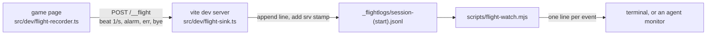
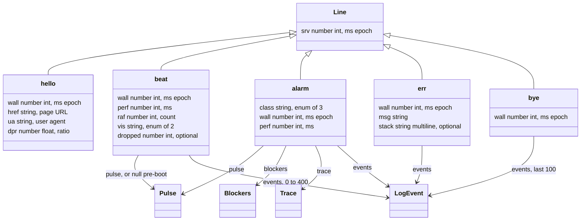
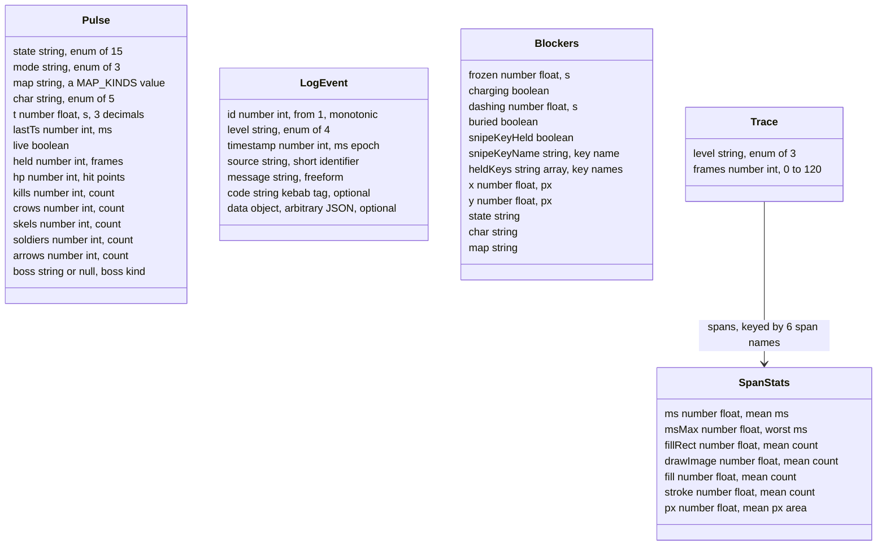
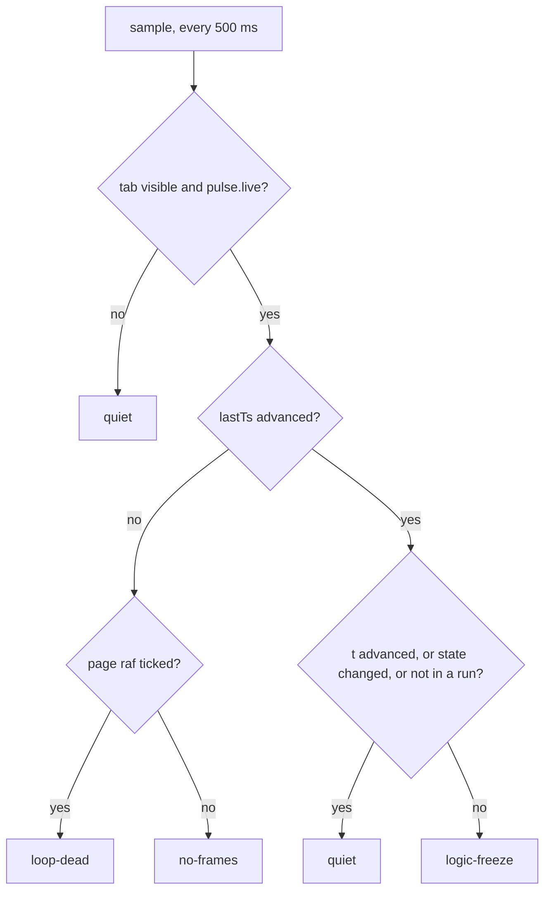

# Monitored playtests

This page is the operating manual for the flight recorder: how to run a
recorded playtest, the complete wire format of the log it produces, how each
kind of stop appears in that log, and what a fresh session needs to resume
the work. The design rationale (why beats, why a server stamp, which halves
live where) is in
[architecture.md](../architecture.md#the-flight-recorder) and is not repeated
here.

The recorder found two shipped bugs on its first day of use (2026-08-30):
a frame-loop crash in `PathScheduler.invalidateThrough` and a latched WASD
key. Both were diagnosed from log lines of the kinds documented below.

## Overview

The system has four parts.

| Part | File | Role |
|---|---|---|
| recorder | `src/dev/flight-recorder.ts` | Runs in the game page. Sends telemetry once per second and raises alarms. |
| sink | `src/dev/flight-sink.ts` | A vite dev-server plugin. Receives telemetry and appends it to the log file. |
| flight log | `_flightlogs/session-<start>.jsonl` | The recorded session. One JSON object per line. |
| watcher | `scripts/flight-watch.mjs` | Follows the newest log and prints one line per notable record. |



The endpoint path `/__flight` is defined once, in `src/dev/flight-path.ts`,
and imported by both halves.

### Topology

The complete system, producers to consumers:

```
+---------------------------- game page (dev build only) ---------------------+
|                                                                             |
|  producers                          src/sim/log.ts                          |
|    game.js transitionTo()   info --+                                        |
|    EventBus, every emit    debug --+--> Logger ring, 500 entries            |
|    logTraceSummary, 1/s    debug --+    {id, level, timestamp, source,      |
|    route invalidation      debug --+     message, code?, data?}             |
|    window error hooks      error --+           |                            |
|    recorder lifecycle   info/err --+           |  drained by id watermark   |
|                                                v                            |
|  window.__game.pulse() ----------->  src/dev/flight-recorder.ts             |
|    state, t, lastTs, counts          |  beat timer  1000 ms -> beat         |
|                                      |  watchdog     500 ms -> classify     |
|  own requestAnimationFrame  ------>  |     -> alarm, once per episode       |
|    the page-alive reference          |  error hooks         -> err          |
|                                      |  pagehide            -> bye          |
+--------------------------------------+--------------------------------------+
                                       |
                    fetch POST /__flight      (beat)
                    sendBeacon /__flight      (alarm, err, bye; survives
                                               page unload)
                    one JSON object per request; the sender goes quiet
                    after 5 consecutive failures
                                       |
                                       v
+---------------------------- vite dev server --------------------------------+
|  src/dev/flight-sink.ts   plugin, apply 'serve'; absent from builds         |
|    /__flight middleware:  non-POST -> 405, body over 1 MB -> dropped,       |
|    non-object JSON -> 400, else wrap {...body, srv: Date.now()} -> 204      |
|    append one line -> _flightlogs/session-<server-start>.jsonl              |
+--------------------------------------+--------------------------------------+
                                       |
                                       |  poll every 500 ms: pick the newest
                                       |  *.jsonl, read from the last offset
                                       v
+------------------------------- consumers -----------------------------------+
|  scripts/flight-watch.mjs  (npm run flight:watch)                           |
|    prints hello, bye, transitions, alarms, uncaught errors;                 |
|    emits HANG? after 3.5 s without a beat while the last state was a run    |
|  an agent monitor wrapping the same script: one notification per line       |
|  ad-hoc readers: the commands in the section "Reading a log"                |
+-----------------------------------------------------------------------------+
```

Component notes, top to bottom:

- The six producers write into one shared `Logger` instance
  (`src/sim/log.ts`). The `EventBus` subscription is registered at module
  load by `attachToEvents`; it costs nothing until the recorder raises the
  log floor to `debug`.
- The recorder polls `devHooks.pulse()` for game state and keeps its own
  `requestAnimationFrame` counter as the page-alive reference. It never
  imports `game.js`; it reads `window.__game`.
- Beats use `fetch` with `keepalive`. Alarms, errors and the goodbye prefer
  `navigator.sendBeacon`, which the browser completes even while the page
  unloads. Both carry one JSON object per request.
- The sink is the only writer of the log file. It answers 405 to non-POST,
  400 to a body that is not a JSON object, and 204 on append. It creates
  `_flightlogs/` on first use.
- The watcher is stateless across restarts except for its read offset; on
  attach it re-reads the newest file from the start, so its first burst is
  history.

## Running a monitored session

1. Create a worktree for the branch under test and arm the git hooks. Hooks
   are per-worktree; a fresh worktree starts unguarded.

   ```bash
   git -C <repo> worktree add .claude/worktrees/<name> <branch>
   ```

   ```bash
   cd <repo>/.claude/worktrees/<name> && npm install && npm run hooks:install
   ```

   where
   - `<repo>` is the clone root, for example `C:\Users\bison\OneDrive\labs\robinhood`.
   - `<name>` is the worktree directory name.
   - `<branch>` is the branch to serve.

2. Start the dev server. The sink rides inside it; no second process exists.

   ```bash
   npm run dev -- --port 8090 --strictPort
   ```

   Any free port works. `--strictPort` makes vite fail instead of moving to
   another port, which matters when a player is about to be handed the URL.
   At startup the server prints `flight sink: <file>`. That file is the log
   for this server run.

3. Hand the player the URL. The recorder is on by default under `npm run
   dev`. The query parameter `rec=0` disables it for one page session.

4. Optionally follow the log live:

   ```bash
   npm run flight:watch
   ```

   The watcher prints one line per alarm, uncaught error, state transition,
   page connect and page goodbye, plus a `HANG?` line of its own when beats
   stop during a run. An agent runs the same script as a background monitor
   and receives one notification per line.

> **Note.** One game page at a time. Beats carry no client identifier, so
> two open pages interleave into one file and gap detection misreads them
> as one page.

> **Note.** The watcher follows the newest `.jsonl` file in the directory
> and reads it from the start when it attaches. The first burst of output
> after attaching is history, not live traffic.

> **Note.** When a harness drives the page instead of a human: a hidden
> Browser pane starves `requestAnimationFrame` while
> `document.visibilityState` still reports `visible`. The recorder
> classifies that state as `no-frames`. To run the real loop in such a pane,
> execute `setInterval(() => __game.frame(16.7), 16)` in the page.
> `devHooks.frame()` keeps `pulse.live` true, so the watchdogs stay armed;
> `devHooks.takeClock()` sets it false and stands them down.

## The flight log

The sink writes `_flightlogs/session-<start>.jsonl`, where `<start>` is the
server start time in ISO format with `:` and `.` replaced by `-`. One file
per dev-server run. The directory is gitignored.

Each line is one JSON object: the body of one POST from the page, plus one
field the sink adds.

- `srv` (number, ms since epoch) is the server's receive time. The sink
  overwrites any client-sent `srv`. This is the one timestamp the page
  cannot produce, so a gap between consecutive `srv` values is measured on
  a clock that keeps running when the page hangs.

Four clocks appear in the file.

| Field | Type | Unit | Set by | Use |
|---|---|---|---|---|
| `srv` | number | ms epoch | sink, at receive | ordering; hang detection by gap |
| `wall` | number | ms epoch | page, `Date.now()` | matching a human report ("it broke around 17:14") |
| `perf` | number | ms | page, `performance.now()`, rounded | monotonic page-relative time |
| `events[].timestamp` | number | ms epoch | logger, at record | ordering events inside a second |

### Record kinds

Types below are JSON types with their precision and unit. JSON carries no
fixed field lengths; the size bounds that exist are the array caps on the
relations, the enum cardinalities, and the sink's 1,000,000-byte limit per
line (the constant `MAX_BODY_BYTES` in `src/dev/flight-sink.ts`).



The nested objects, fully typed:



| `kind` | Sent when | Fields beyond `srv` and `kind` |
|---|---|---|
| `hello` | page session starts | `wall`, `href`, `ua`, `dpr` |
| `beat` | once per second | `wall`, `perf`, `raf`, `vis`, `pulse`, `events`, `dropped` |
| `alarm` | a watchdog classifies a stop | `class`, `wall`, `perf`, `pulse`, `blockers`, `trace`, `events` |
| `err` | uncaught error or unhandled rejection | `wall`, `msg`, `stack`, `events` |
| `bye` | `pagehide` fires (close, reload, navigate) | `wall`, `events` |

### hello

- `href` (string) is `location.href` of the page.
- `ua` (string) is `navigator.userAgent`.
- `dpr` (number) is `devicePixelRatio`.

```json
{"kind": "hello",
 "wall": 1788101911786,
 "href": "http://localhost:8090/",
 "ua": "Mozilla/5.0 ...",
 "dpr": 1,
 "srv": 1788101911788}
```

### beat

- `raf` (number) is the recorder's own `requestAnimationFrame` counter. It
  is independent of the game loop. It is the reference the watchdog uses to
  decide whether the page as a whole is animating.
- `vis` (string) is `document.visibilityState`: `visible` or `hidden`.
- `pulse` (object or null) is the game state snapshot defined below. It is
  null only before `boot()` has attached `window.__game`.
- `events` (array of LogEvent) is everything the diagnostic log recorded
  since the previous drain, at most 400 entries.
- `dropped` (number, optional) is present when more than 400 events were
  pending; it counts the entries that were discarded, oldest first.

A real beat from a boss fight, second event abridged:

```json
{"kind":"beat","wall":1788102822416,"perf":45313,"raf":8097,"vis":"visible",
 "pulse":{"state":"boss_fight","mode":"brawl","map":"forest","char":"ranger",
          "t":35.133,"lastTs":45311,"live":true,"held":0,"hp":8,"kills":10,
          "crows":6,"skels":0,"soldiers":0,"arrows":3,"boss":"crowking"},
 "events":[{"id":126,"level":"info","timestamp":1788102821670,
            "source":"transitionTo",
            "message":"boss_entrance -> boss_fight",
            "data":{"prev":"boss_entrance","next":"boss_fight",
                    "gameMode":"brawl","mapKind":"forest"}}],
 "srv":1788102822417}
```

### pulse

Produced by `devHooks.pulse()` in `src/legacy/game.js`. Appears in `beat`
and `alarm`.

| Field | Type | Meaning |
|---|---|---|
| `state` | string | current `appState` |
| `mode` | string | game mode: `brawl`, `waves`, `siege` |
| `map` | string | map kind, for example `forest` |
| `char` | string | selected character: `archer`, `wizard`, `knight`, `ranger`, `sapper` |
| `t` | number | sim seconds, 3 decimals |
| `lastTs` | number | the game loop's frame clock, ms, rounded |
| `live` | boolean | false while a harness holds the clock |
| `held` | number | hitstop frames still owed |
| `hp` | number | player hit points |
| `kills` | number | kill count this run |
| `crows` | number | length of the `crows` array |
| `skels` | number | length of the `skeletons` array |
| `soldiers` | number | length of the `soldiers` array |
| `arrows` | number | length of the player projectile array |
| `boss` | string or null | boss kind, null when none is spawned |

- `state` takes the values the render dispatch in `game.js` branches on:
  `menu`, `charselect`, `mapselect`, `controls`, `playing`, `stage_intro`,
  `boss_entrance`, `boss_fight`, `paused`, `chooser`, `inventory`,
  `talents`, `gameover`, `win`, `multiplayer`.
- `t` advances only in `playing` and `boss_fight`; every other state holds
  it. A stuck `t` outside those states is normal.
- `lastTs` is the timestamp of the most recent `loop()` call. If it stops
  changing, the loop has stopped running.
- `live` is set false by `devHooks.takeClock()` and never by gameplay. The
  watchdogs stand down while it is false.
- `held` drains by one per fixed step. Values above the hitstop ladder's
  maximum indicate a bug, not a long effect.
- `boss` values observed: `crowking`, `dark_archer`, `dark_knight`,
  `minotaur`.

### events entries (LogEvent)

The entries are the ring buffer of the shared logger in `src/sim/log.ts`,
drained incrementally: the recorder remembers the highest `id` it shipped
and sends only newer entries. The ring holds 500 entries; an unshipped
overflow is lost oldest first.

| Field | Type | Meaning |
|---|---|---|
| `id` | number | monotonic per page session, from 1; resets on reload |
| `level` | string | `debug`, `info`, `warn`, `error` |
| `timestamp` | number | ms epoch at record time |
| `source` | string | the caller's name for itself |
| `message` | string | human-readable event text |
| `code` | string, optional | machine-checkable tag, set only on `error` entries |
| `data` | object, optional | structured context |

Sources observed in practice:

| `source` | Level | Carries |
|---|---|---|
| `transitionTo` | info | every `appState` change, with `prev`, `next`, `gameMode`, `mapKind` |
| `EventBus` | debug | every gameplay event; `message` is the event type, `data` its payload |
| `trace` | debug | once per second, the frame tracer's per-section rows and the worst section |
| `path` | debug | a terrain change dropped cached routes; `data` has `r`, `c`, `dropped` |
| `recorder` | info, error | recorder lifecycle, tab visibility changes, alarms |
| `window` | error | uncaught errors, with file and line in `data` |

Two real entries:

```json
{"id": 4, "level": "info", "timestamp": 1788101933171,
 "source": "transitionTo", "message": "menu -> playing",
 "data": {"prev": "menu", "next": "playing",
          "gameMode": "brawl", "mapKind": "forest"}}
```

```json
{"id": 3, "level": "debug", "timestamp": 1788101913262,
 "source": "trace", "message": "1 frames",
 "data": {"map": "forest", "worst": "sim",
          "rows": ["sim   0.10ms   max 0.10   0 fill   0 img   0.00Mpx"]}}
```

### alarm

- `class` (string) is one of `loop-dead`, `logic-freeze`, `no-frames`. The
  section "Stop classification" defines each.
- `pulse` is the snapshot at the moment the alarm raised.
- `blockers` (object) is `devHooks.movementBlockers()`:

  | Field | Type | Meaning |
  |---|---|---|
  | `frozen` | number | seconds of freeze effect remaining on the player |
  | `charging` | boolean | knight charge wind-up active |
  | `dashing` | number | knight dash timer, seconds |
  | `buried` | boolean | the player does not fit at its own position |
  | `snipeKeyHeld` | boolean | the snipe key is currently down |
  | `snipeKeyName` | string | which key that is, default `Shift` |
  | `heldKeys` | string array | every name currently down in the `keys` map |
  | `x`, `y` | number | player position, px |
  | `state`, `char`, `map` | string | as in `pulse` |

  `heldKeys` is the field that exposes a latched key: a name listed here
  that the player is not physically holding.

- `trace` (object) is the frame tracer readout: `level` (string: `off`,
  `time`, `ops`), `frames` (number of frames held, at most 120), and
  `spans`, an object keyed by section name. The sections, in frame order:
  `sim`, `tiles`, `fog`, `bodies`, `vignette`, `hud`. Each holds:

  | Field | Type | Meaning |
  |---|---|---|
  | `ms` | number | mean milliseconds per frame over the held frames |
  | `msMax` | number | worst single frame, ms |
  | `fillRect`, `drawImage`, `fill`, `stroke` | number | mean canvas call counts; zero unless level is `ops` |
  | `px` | number | mean fill area, px; zero unless level is `ops` |

- `events` is a drain, as in `beat`.

A real alarm, `spans` and later events elided:

```json
{"kind":"alarm","class":"loop-dead","wall":1788102842916,"perf":65813,
 "pulse":{"state":"boss_fight","t":53.85,"lastTs":64488,"live":true,
          "held":0,"boss":"crowking","...":"..."},
 "blockers":{"frozen":0,"charging":false,"dashing":0,"buried":false,
             "snipeKeyHeld":false,"snipeKeyName":"Shift","heldKeys":[],
             "x":678.87,"y":190.09,
             "state":"boss_fight","char":"ranger","map":"forest"},
 "trace":{"level":"time","frames":120,"spans":"..."},
 "events":[{"id":280,"level":"error","timestamp":1788102842916,
            "source":"recorder",
            "message":"loop-dead after 1000ms","code":"loop-dead"}],
 "srv":1788102842917}
```

### err

- `msg` (string) is the error message.
- `stack` (string, optional) is the stack trace when the error object
  carried one; absent for unhandled rejections of non-Error values.
- `events` is a drain, as in `beat`.

The line that identified the brawl freeze, stack abridged to two frames:

```json
{"kind":"err","wall":1788102841592,
 "msg":"Uncaught TypeError: Cannot read properties of undefined (reading 'length')",
 "stack":"TypeError ... at invalidateThrough (pathfinding.ts:67:30) ...",
 "srv":1788102841594}
```

### bye

- `events` is the final drain, capped at the last 100 entries because the
  goodbye is sent with `navigator.sendBeacon`, which limits payload size.

```json
{"kind":"bye","wall":1788102120910,"events":[],"srv":1788102120912}
```

> **Note.** A `bye` means the page left on purpose (close, reload,
> navigation). A log that ends without one ended abnormally. `pagehide` can
> be skipped when a browser process is killed outright, so treat a missing
> `bye` as strong evidence, not proof.

### Timing constants

| Constant | Value | Defined in |
|---|---|---|
| beat interval | 1000 ms | `flight-recorder.ts` `BEAT_MS` |
| watchdog sample interval | 500 ms | `flight-recorder.ts` `WATCH_MS` |
| alarm streak, `loop-dead` | 2 samples (1 s) | `flight-recorder.ts` `ALARM_AFTER` |
| alarm streak, `logic-freeze` | 4 samples (2 s) | `flight-recorder.ts` `ALARM_AFTER` |
| alarm streak, `no-frames` | 10 samples (5 s) | `flight-recorder.ts` `ALARM_AFTER` |
| events per beat, maximum | 400 | `flight-recorder.ts` `MAX_EVENTS_PER_BEAT` |
| send failures before giving up | 5 consecutive | `flight-recorder.ts` `MAX_SEND_FAILURES` |
| logger ring capacity | 500 entries | `src/sim/log.ts` `Logger` |
| sink body limit | 1,000,000 bytes | `flight-sink.ts` `MAX_BODY_BYTES` |
| watcher poll interval | 500 ms | `flight-watch.mjs` `POLL_MS` |
| watcher hang threshold | 3500 ms without a beat | `flight-watch.mjs` `HANG_AFTER_MS` |

## Stop classification

The watchdog samples `pulse` every 500 ms and compares it with the previous
sample. `classify` in `src/dev/flight-recorder.ts` is the decision table;
an alarm raises after the class holds for its streak length, once per
episode.



| Class | Evidence | Meaning |
|---|---|---|
| `loop-dead` | game clock stalled while the page still animates | an exception unhooked the rAF loop; expect an `err` line immediately before |
| `logic-freeze` | frames arrive but `t` is stuck during `playing` or `boss_fight` | the sim is being held; the 2 s streak outlasts any legitimate hitstop |
| `no-frames` | nothing animates while the tab claims `visible` | the environment starved rAF: window occlusion, an embedded pane |
| hard hang | beats stop; no `bye` at end of file | the main thread hung; no alarm line exists because the page runs no code |

For a hard hang, the timestamp is the last `srv` plus about one second, and
the last beat's `trace` and `events` describe the final recorded second.

> **Note.** Browsers throttle timers in hidden tabs to roughly one fire per
> minute. A page that is already `loop-dead` and then backgrounded produces
> sparse beats, which the watcher reports as alternating `HANG?` and
> `beats resumed` lines. Read those against the earlier alarm, not as a new
> failure.

## Reading a log

Kind counts plus every alarm and error:

```bash
node -e "const l=require('fs').readFileSync(process.argv[1],'utf8').trim().split('\n').map(JSON.parse);const k={};for(const r of l)k[r.kind]=(k[r.kind]||0)+1;console.log(k);for(const r of l)if(r.kind==='alarm'||r.kind==='err')console.log(new Date(r.srv).toISOString(),r.kind,r.class||r.msg)" <file>
```

where
- `<file>` is a path under `_flightlogs/`.

All records inside a wall-clock window, for chasing a human report:

```bash
node -e "const[f,a,b]=process.argv.slice(1);const t0=Date.parse(a),t1=Date.parse(b);for(const r of require('fs').readFileSync(f,'utf8').trim().split('\n').map(JSON.parse))if(r.srv>=t0&&r.srv<=t1)console.log(new Date(r.srv).toISOString(),r.kind,JSON.stringify(r.pulse||r.msg||r.class||'').slice(0,120))" <file> <fromISO> <toISO>
```

where
- `<fromISO>` and `<toISO>` are ISO timestamps, for example
  `2026-08-30T15:13:50Z` and `2026-08-30T15:14:10Z`.

## The release build

The production build contains no recorder code. `src/main.js` imports
`src/dev/flight-recorder.ts` dynamically inside an `import.meta.env.DEV`
conditional, so `vite build` excludes the module and everything only it
imports. The sink plugin declares `apply: 'serve'`, so build output has no
`/__flight` route. There is no runtime flag to disable because the code is
absent from the artifact.

`?rec=0` disables the recorder for one dev page session. That is the only
switch that exists.

## Planned work: verbosity levels

Status: not built. Requested by the owner on 2026-08-30. This section is
the task brief, not a description of current behavior.

The goal is an instrumented, release-shaped build for bugs that only occur
in the single-file artifact. The requested shape:

| `?rec=` value | Sends |
|---|---|
| `off` | nothing |
| `alarms` | `hello`, `err`, `alarm`, `bye` |
| `beats` | the above plus `beat` without `events` |
| `full` | everything, as today |

Constraints for whoever builds it:

- One constant table in `flight-recorder.ts` maps level to behavior. No
  scattered conditionals.
- A non-dev build defaults to `off` and requires an explicit sink origin
  before sending anything anywhere.
- The `import.meta.env.DEV` exclusion for the normal release must survive
  unchanged.
- Add a per-page client id to `hello` and `beat` in the same change. That
  lifts the one-page-at-a-time restriction above.

## Resuming this work

State as of 2026-08-30, all branches local, none pushed. `COORDINATION.md`
at the repo root governs rounds, worktrees and pushing; read it before
touching `origin`.

| Branch | Content |
|---|---|
| `feat/flight-recorder` | recorder, sink, watcher, this page |
| `fix/invalidate-routeless-agents` | the brawl-freeze fix and its two regression tests |
| `fix/wasd-shift-latch` | the latched-key fix and `noteKeyDown` / `noteKeyUp` in `src/sim/input.ts` |
| `verify/brawl-freeze` | the three above merged, for live verification; discard after the round merges |

To serve a worktree from a session whose own directory is elsewhere, point
npm at it in `.claude/launch.json`:

```json
{
  "name": "flight-dev",
  "runtimeExecutable": "npm",
  "runtimeArgs": ["--prefix", "<worktree>", "run", "dev", "--", "--port", "8090", "--strictPort"],
  "port": 8090
}
```

where
- `<worktree>` is the absolute path of the checkout to serve.
