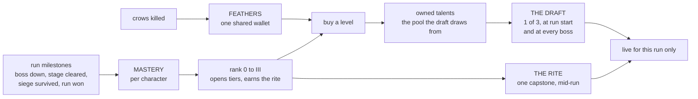
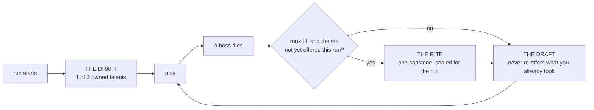

# Talents

What a character *can* buy, what they *own*, and what is *awake* for one run —
three separate things, deliberately. The generic axes (health, speed, tool
capacity) stay in the FEATHERS tree the [manual](manual.md#systems) describes;
this document is the per-character half that sits beside it.

- [The three layers](#the-three-layers)
- [Mastery and ranks](#mastery-and-ranks)
- [The wizard's tree](#the-wizards-tree)
- [What a run looks like](#what-a-run-looks-like)
- [The other four heroes](#the-other-four-heroes)
- [Where the code lives](#where-the-code-lives)

## The three layers

Two currencies and one filter. **Feathers** are the shared wallet already
earned from kills; **mastery** is per character and comes from finishing
things, never from grinding; and the **draft** decides which of the talents
you own are actually live this run.

The rule that makes the third layer worth having: **an owned talent that this
run did not draft is worth exactly its base figure.** Buying a level does not
make the wizard stronger everywhere — it adds a card the run may deal you.
Ownership grows options, not raw power, so a long-played character has a wider
draft rather than a bigger number.

## Mastery and ranks

Mastery pays for *finishing things*, so a run abandoned at the first wave banks
nothing and a run carried to the bastion banks well.

| Milestone | Points | Paid when |
|---|---|---|
| `boss_down` | 2 | any boss dies, siege bosses included |
| `stage_cleared` | 1 | the crow king, dark archer and dark knight hand-offs, and the maze door |
| `siege_cleared` | 3 | the bastion's ten waves survived |
| `run_won` | 3 | the win screen, by whichever route reaches it |

Ranks are the thresholds those points cross, and a rank opens the tier one
above it — so tier I is open to a character who has never finished anything,
which is what lets the draft pool start existing at all.

| Rank | Mastery | Opens |
|---|---|---|
| 0 | 0 | Tier I |
| I | 4 | Tier II |
| II | 10 | Tier III |
| III | 18 | The rite |

## The wizard's tree

The wizard pilots the system; his is the only tree with rows in it. Costs are
a ladder read cheapest-first, so a talent's maximum level is the length of its
own price list and is never written down twice.

| Talent | Tier | Levels | Costs | Each level | Base it stacks on |
|---|---|---|---|---|---|
| FOCUS DEPTH | I | 1 | 26 | +1 Focus | a pool of 3 |
| LONG STEP | I | 2 | 12, 24 | +20 px blink | 160 px |
| WIDER SKY | II | 2 | 20, 38 | +50 px storm radius | 450 px |

FOCUS DEPTH is one level on purpose: a full pool buying a fourth bolt is the
whole of what it promises, and a second level would quietly rewrite what Focus
costs mean. Tier III exists in the model and holds no wizard talent yet.

The two capstones are **earned, not bought** — reaching rank III is the price,
and the rite's pick lasts one run. They are exclusive, and a tree offers either
none or at least two, because a rite with a single option is a cutscene rather
than a choice.

| Capstone | Effect |
|---|---|
| OVERCHANNEL | Bolts cost no Focus for 4 s after a blink lands — the escape button becomes the attack button |
| STORMCALLER | Lightning Storm recharges in half the time, everywhere the wait is shown |

## What a run looks like

Both ceremonies sit over whatever screen the hand-off staged and give it back
when you pick, so neither interrupts a stage transition it landed in the middle
of.

An empty pool skips the ceremony rather than showing an empty screen, so a
character who owns nothing plays exactly as they did before the system existed.
The rite is offered once per run whether or not it is liked, and outranks the
draft when a boss owes both.

Both screens are drawn in the character-select screen's own anatomy, over the
same geometry module (`src/render/panel-row.ts`): the row is sized from the
canvas rather than a design width, slot centres are fixed and only the picked
panel grows about its own, and an offer can be clicked as well as keyed. Each
wears its own accent, sigil, hook line and tier footer. The
[screens playbook](playbooks/screens.md) is why it is built that way.

## The other four heroes

The archer, knight, ranger and sapper have explicit empty rows in `CHAR_TREES`
rather than absent ones. That is the shape the compiler can check: a hero
missing a tree is a build error rather than a silent fall-through, which is
the exact failure [Design patterns](design-patterns.md) records shipping once
already when a table was keyed positionally.

An empty tree owns nothing, so those four never see a draft or a rite.

## Where the code lives

The split is the one FEATHERS already uses: arithmetic that can be checked
without a canvas lives in the simulation, and everything needing a browser or
a run stays with the game.

| Concern | Home |
|---|---|
| Trees, tiers, prices, mastery arithmetic, the draft deal | `src/sim/talents.ts` |
| Save file, mastery awards, the run's drafted set, the rite's seal, effective figures | `TALENTS` in `src/legacy/game.js` |
| The draft and rite screens | `drawChooser()` and `TALENT_LOOK` in `src/legacy/game.js` |
| Purchases, spending the wallet | `TALENTS.buy()`, which spends through `FEATHERS.spend()` |

Talents have no buy screen yet: `TALENTS.buy()` is reachable from the console
(`__game.talents()`) and enforces both the mastery gate and the wallet, but
nothing on the inventory screen offers a purchase.
