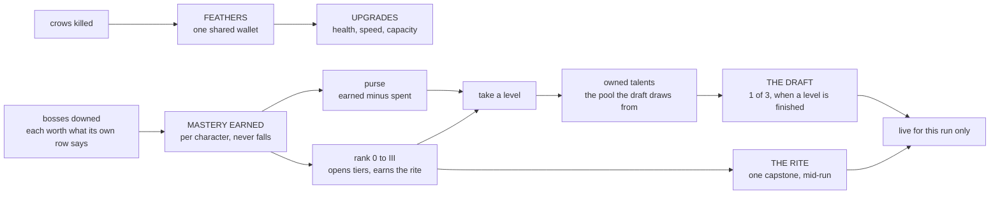
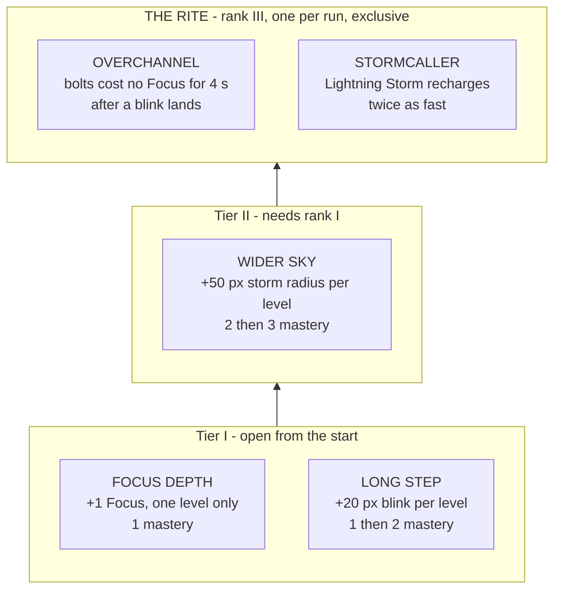
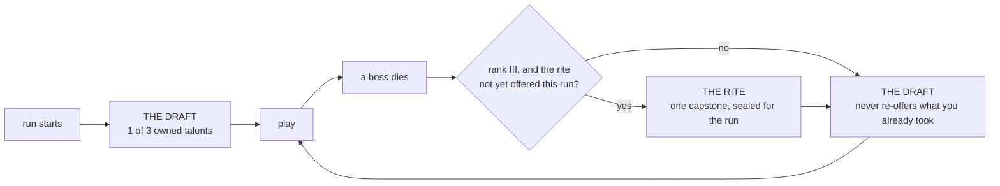

# Talents

What a character *can* buy, what they *own*, and what is *awake* for one run —
three separate things, deliberately. The generic axes (health, speed, tool
capacity) stay in the FEATHERS tree the [manual](manual.md#systems) describes;
this document is the per-character half that sits beside it.

- [The three layers](#the-three-layers)
- [Mastery and ranks](#mastery-and-ranks)
- [The wizard's tree](#the-wizards-tree)
- [Buying them](#buying-them)
- [The axes that have not moved yet](#the-axes-that-have-not-moved-yet)
- [What a run looks like](#what-a-run-looks-like)
- [The other four heroes](#the-other-four-heroes)
- [What the colours mean](#what-the-colours-mean)
- [What a ceremony will not interrupt](#what-a-ceremony-will-not-interrupt)
- [Where the code lives](#where-the-code-lives)

## The three layers

Two currencies that never meet, and one filter. **Feathers** are the shared
wallet earned from kills, and they buy *upgrades* — health, speed, capacity.
They buy no talents at all. **Mastery** is per character, comes from bosses,
and is what talents cost. The **draft** then decides which of the talents you
own are actually live this run.

Keeping them apart is the whole point. One purse funding both ladders would
make the player choose between a talent and a heart, which is not a choice
either tree was built to ask.

The rule that makes the third layer worth having: **an owned talent that this
run did not draft is worth exactly its base figure.** Buying a level does not
make the wizard stronger everywhere — it adds a card the run may deal you.
Ownership grows options, not raw power, so a long-played character has a wider
draft rather than a bigger number.

## What a boss is worth

Mastery is loot. Each boss pays what its own row says, so the curve is a table
rather than a constant:

| Boss | Mastery |
|---|---|
| Crow King | 1 |
| Dark Archer | 2 |
| Dark Knight | 2 |
| Minotaur | 3 |
| Commander | 3 |

The crow king pays one, which is exactly the price of a tier-I first level. A
first kill therefore buys one talent and asks for one decision, rather than
dropping five at once. Raising a later boss is an edit to one row of
`BOSS_MASTERY` and nothing else.

**Earned and spent are two figures, not one balance.** Mastery earned never
falls, because it is what opens tiers; spending is tracked separately and the
purse is the gap between them. A single counter could not do both jobs — paying
for a talent would shut the tier it was bought in, so a player would lose the
rank their kills had already won.

## Mastery and ranks

Mastery pays for *finishing things*, so a run abandoned at the first wave banks
nothing and a run carried to the bastion banks well.

| Milestone | Points | Paid when |
|---|---|---|
| `boss_down` | 2 | any boss dies, siege bosses included |
| `stage_cleared` | 1 | the crow king, dark archer and dark knight hand-offs, and the maze door |
| `siege_cleared` | 3 | the bastion's ten waves survived |
| `run_won` | 3 | the win screen, by whichever route reaches it |

Ranks are the thresholds those points cross, and a rank opens the tier one
above it — so tier I is open to a character who has never finished anything,
which is what lets the draft pool start existing at all.

| Rank | Mastery | Opens |
|---|---|---|
| 0 | 0 | Tier I |
| I | 4 | Tier II |
| II | 10 | Tier III |
| III | 18 | The rite |

## The wizard's tree

The wizard piloted the system, so his tree is the one the rest were built
against. Costs are a ladder read cheapest-first, so a talent's maximum level is
the length of its own price list and is never written down twice.

| Talent | Tier | Levels | Costs | Each level | Base it stacks on |
|---|---|---|---|---|---|
| FOCUS DEPTH | I | 1 | 1 | +1 Focus | a pool of 3 |
| LONG STEP | I | 2 | 1, 2 | +20 px blink | 160 px |
| WIDER SKY | II | 2 | 2, 3 | +50 px storm radius | 450 px |

FOCUS DEPTH is one level on purpose: a full pool buying a fourth bolt is the
whole of what it promises, and a second level would quietly rewrite what Focus
costs mean. Tier III exists in the model and holds no wizard talent yet.

The two capstones are **earned, not bought** — reaching rank III is the price,
and the rite's pick lasts one run. They are exclusive, and a tree offers either
none or at least two, because a rite with a single option is a cutscene rather
than a choice.

| Capstone | Effect |
|---|---|
| OVERCHANNEL | Bolts cost no Focus for 4 s after a blink lands — the escape button becomes the attack button |
| STORMCALLER | Lightning Storm recharges in half the time, everywhere the wait is shown |

## Buying them

`[T]` from the pause menu, or `[T]` from the upgrade screen — the two shops
sit beside each other because they spend the same wallet, and `[U]` goes back
the other way. Arrows or a click move the cursor; `ENTER`, or a second click
on the row you are already on, buys.

A row shows its sigil, what kind of thing it is, its tier, what it does, the
price of its *next* level, and how many levels are already held. A tier the
character's mastery has not opened is dimmed and priced as `LOCKED · RANK n`
rather than hidden: what you are climbing toward is the reason to climb. The
rite sits under the rows, named and greyed until rank III, because it is
earned and never bought.

A refusal is always worded. Pressing `ENTER` on a talent you cannot afford
prints how much more mastery you need; on a locked tier it prints the rank
you need against the rank you hold. The one thing the screen must never do is
nothing at all — the player pressed a key, and silence reads as a screen that
did not hear them. `_talentBuyNote` throws on a purchase result it has no
wording for, so a new outcome cannot arrive as a blank line.

Both shops lay their rows out with `src/render/list-rows.ts`: widths off the
canvas rather than a design width, a pitch that shrinks to fit but never
spreads, a short list centred in its band, and the rects the click handler
tests are the rects the draw used. Buying that geometry also fixed the upgrade
screen, which had drawn a literal 560 px row whatever the canvas was.

## The axes that have not moved yet

The design splits upgrades in two: the FEATHERS tree keeps what every hero
has, and kit-specific axes move into the character trees here. That move has
not happened. Four axes are still in the shared tree wearing generic clothes,
and thirteen of the shop's forty cells do nothing at all for the hero playing
them.

| Axis | archer | wizard | knight | ranger | sapper |
|---|:-:|:-:|:-:|:-:|:-:|
| QUIVER DEPTH `arrows` | ● | — | — | ● | — |
| FLETCHER CACHE `restore` | ● | — | — | ● | — |
| POWDER KEG `tools` | ● | — | — | ● | — |
| TINE REACH `pfRange` | ● | ● | — | ● | ● |
| VITALITY, SWIFTNESS, PLUME BOUNTY, WARD FEATHER | ● | ● | ● | ● | ● |

Read that bottom-left cell twice. **POWDER KEG says "tool capacity" and does
nothing for the sapper**, the one hero built entirely around throwing: it sets
`dynamites.max` and `satchels.max`, and he spends `bombs`, which no upgrade and
no pace preset has ever touched. The knight is the other outlier — he spends
nothing at all, so both quiver axes are dead for him, and his sword is his
primary rather than an out-of-ammo fallback, which is why TINE REACH is dead
too.

The map lives in `AXIS_HEROES` (`src/sim/upgrades.ts`) and is **measured, not
asserted**: `upgrades-reach.test.ts` plays each hero, fires every button they
have, and checks which pools actually go down. A hand-written map is right
until somebody gives the knight a crossbow.

Until the split happens the shop greys a dead cell, labels it `NOTHING FOR THE
<HERO>` and refuses the purchase. The wallet is shared, so the same level
bought while playing a hero it serves is worth exactly as much — this costs the
player nothing and stops the shop taking 45 mastery for a keg the sapper's
pouch never reads.

**The split itself is not decided.** Moving these four out means choosing, per
hero, which axis becomes which talent, at which tier and price, deciding what
the sapper's bomb capacity should cost when his pool is 10 deep and the
archer's is 3, and deciding what happens to levels players have already bought.
Those are balance calls, not refactors.

## What a run looks like

Both ceremonies sit over whatever screen the hand-off staged and give it back
when you pick, so neither interrupts a stage transition it landed in the middle
of.

An empty pool skips the ceremony rather than showing an empty screen, so a
character who owns nothing plays exactly as they did before the system existed.
The rite is offered once per run whether or not it is liked, and outranks the
draft when a boss owes both.

Both screens are drawn in the character-select screen's own anatomy, over the
same geometry module (`src/render/panel-row.ts`): the row is sized from the
canvas rather than a design width, slot centres are fixed and only the picked
panel grows about its own, and an offer can be clicked as well as keyed. Each
wears its own accent, sigil, hook line and tier footer. The
[screens playbook](playbooks/screens.md) is why it is built that way.

## The other four heroes

Every hero's tree deepens that hero's own passive. That is the whole design
rule, and it is what keeps the archer and the ranger diverging rather than
converging: they share a quiver, and one is paid for standing still while the
other is paid for never doing it. Buying into either makes that difference
larger, not smaller.

Every row is a real figure the game runs on — thirteen of the twenty scale a
`CONFIG` number, and the remaining seven are unlocks. A talent whose effect
nothing reads must not ship, so `TALENTS.STATS` is checked at load: a numeric
talent with no row throws by name rather than handing `NaN` to a consumer.

| Hero | Deepens | Tier I | Tier II | The rite |
|---|---|---|---|---|
| Archer | Brace | SET FEET, DEEP ROOTS | SPLIT SHAFT | ROOTED / SPLINTER |
| Knight | Bloodlust | DEEPER CUT, FOURTH BLOOD | CHARGE THROUGH | BERSERKER / JUGGERNAUT |
| Ranger | Momentum | LIGHT FOOT, LONG WIND | FULL TILT | SLIPSTREAM / SHRAPNEL |
| Sapper | Chain detonation | LONG FUSE, MORE LINKS | STICKY FAN | DEMOLITIONIST / SHOCKWAVE |

Two figures worth stating outright, because they were set deliberately rather
than derived. The ranger's FULL TILT adds **5% a level over three levels**, so
her ceiling is **45%** rather than the 30% she starts with — and it still
multiplies with pickups instead of replacing them. And the knight's FOURTH
BLOOD is a single level: a fourth stack, not a fourth axis.

## What the colours mean

A talent's colour says what it *does*, not whose tree it came from. Inside a
chooser every offer belongs to the same hero, so colouring by hero spent the
slot on the one thing the player already knew — three sapper offers in three
identical oranges. `TALENT_KINDS` spends it on the question the row is actually
asking instead.

| Kind | Colour | What it covers |
|---|---|---|
| `direct` — DAMAGE | orange `#FF7A1A` | Puts more damage on the target: reach, pierce, extra blasts, per-hit worth |
| `indirect` — BUILD-UP | gold `#FFCC00` | Pays for damage rather than dealing it: resources, uptime, meters, stacks |
| `mechanic` — MOVEMENT | periwinkle `#8888FF` | Changes where bodies are: movement, placement, phasing, knockback |

The label prints beside the tier, because a colour code nobody can decode is
decoration: the word teaches the colour, and after a few runs the colour works
alone. Tier itself is grey now — it is a word, and it was competing for the
same three hues.

Each talent also carries a **drawn sigil** rather than a printed character. A
glyph is only as good as the font the player happens to have — U+2608 rendered
as an empty box on a default Windows install and shipped that way — and a
drawing depends on nothing. They are generated from the design sheets into path
data, so the shape has one home and the game never parses markup to draw a
frame.

Two trees currently read as one colour on the shop screen and in the draft.
The knight's three buyable talents are all `direct`; the ranger's are all
`indirect`. That is the trees being honest — his three really are all damage,
hers really are all build-up — and it is the colour code working, not failing.
It does mean the code carries no information for those two heroes until a
second kind enters their tier list, which is worth knowing before adding to
either. Recolouring for variety would say something untrue about what the
talents do.

A fourth kind — defensive, healing, damage taken — is **deliberately absent
rather than empty**. Not one of the twenty-five does any of those things; the
FEATHERS tree carries health and the ward. That is a fact about the trees, not
about the palette, and it is worth knowing before designing the next one. An
unused colour would only be a promise the screen does not keep.

## What a ceremony will not interrupt

A chooser never opens during a siege. A siege boss is one enemy inside a wave
rather than the end of a stage — the boss death tail says so itself, and every
brawl hand-off is skipped there for the same reason — so a ceremony held over a
running wave would stop the field with crows still on it. The siege pays its
mastery like any other boss; what it does not do is hold a ceremony about it.

`queueBossChoosers` owns that rule, and the siege path calls it and lets the
guard refuse rather than deciding for itself: two places that both know when a
ceremony is allowed is one too many.

## Where the code lives

The split is the one FEATHERS already uses: arithmetic that can be checked
without a canvas lives in the simulation, and everything needing a browser or
a run stays with the game.

| Concern | Home |
|---|---|
| Trees, tiers, prices, mastery arithmetic, the draft deal | `src/sim/talents.ts` |
| Which CONFIG figure each numeric talent moves | `TALENTS.STATS` in `src/legacy/game.js` |
| Each talent's sigil, as path data | `src/render/talent-sigils.ts`, generated from `_design/talent-icons/` |
| Drawing one onto a canvas | `src/render/talent-sigil-paint.ts` |
| Save file, mastery awards, the run's drafted set, the rite's seal, effective figures | `TALENTS` in `src/legacy/game.js` |
| The draft and rite screens | `drawChooser()` and `TALENT_LOOK` in `src/legacy/game.js` |
| The buy screen | `drawTalentTree()` and `talentTreeLayout()` in `src/legacy/game.js` |
| Row geometry, shared with the upgrade screen | `src/render/list-rows.ts` |
| Which upgrade axes reach which hero | `AXIS_HEROES` in `src/sim/upgrades.ts`, measured by `src/legacy/upgrades-reach.test.ts` |
| Purchases, spending mastery | `TALENTS.buy()`; feathers are never touched |
| What each boss pays | `BOSS_MASTERY` in `src/sim/talents.ts` |

The two chooser screens can still be staged by hand with the console verbs
`draft(char)` and `rite(char)` — the same one-word shape `siege(n)` and
`crack(hp)` use. They are reached in play by owning talents and starting a run,
but a ceremony you have to earn twice over is a slow thing to look at.
`draft` grants every talent in that character's tree and starts a run so the
opening draft has a full hand; `rite` puts the character at the rank the rite
wants and opens it. A hero with an empty tree answers plainly and keeps
playing, which is the empty-pool skip doing its job.
