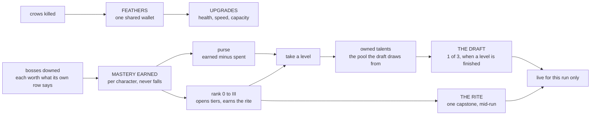
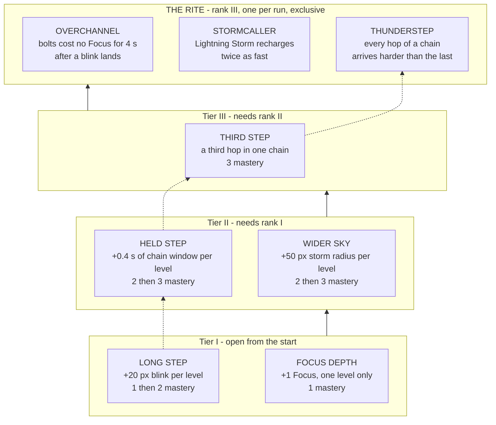
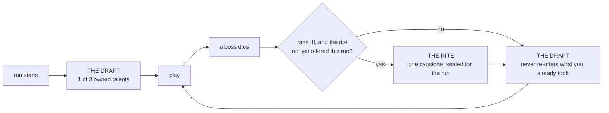

# Talents

What a character *can* buy, what they *own*, and what is *awake* for one run —
three separate things, deliberately. The generic axes (health, speed, tool
capacity) stay in the FEATHERS tree the [manual](manual.md#systems) describes;
this document is the per-character half that sits beside it.

- [The three layers](#the-three-layers)
- [Mastery and ranks](#mastery-and-ranks)
- [The wizard's tree](#the-wizards-tree)
- [The shape](#the-shape)
- [Buying them](#buying-them)
- [The axes that have not moved yet](#the-axes-that-have-not-moved-yet)
- [What a run looks like](#what-a-run-looks-like)
- [The other four heroes](#the-other-four-heroes)
- [What the colours mean](#what-the-colours-mean)
- [What a ceremony will not interrupt](#what-a-ceremony-will-not-interrupt)
- [Where the code lives](#where-the-code-lives)

## The three layers

Two currencies that never meet, and one filter. **Feathers** are the shared
wallet earned from kills, and they buy *upgrades* — health, speed, capacity.
They buy no talents at all. **Mastery** is per character, comes from bosses,
and is what talents cost. The **draft** then decides which of the talents you
own are actually live this run.

Keeping them apart is the whole point. One purse funding both ladders would
make the player choose between a talent and a heart, which is not a choice
either tree was built to ask.

The rule that makes the third layer worth having: **an owned talent that this
run did not draft is worth exactly its base figure.** Buying a level does not
make the wizard stronger everywhere — it adds a card the run may deal you.
Ownership grows options, not raw power, so a long-played character has a wider
draft rather than a bigger number.

## What a boss is worth

Mastery is loot. Each boss pays what its own row says, so the curve is a table
rather than a constant:

| Boss | Mastery |
|---|---|
| Crow King | 1 |
| Dark Archer | 2 |
| Dark Knight | 2 |
| Minotaur | 3 |
| Commander | 3 |

The crow king pays one, which is exactly the price of a tier-I first level. A
first kill therefore buys one talent and asks for one decision, rather than
dropping five at once. Raising a later boss is an edit to one row of
`BOSS_MASTERY` and nothing else.

**Earned and spent are two figures, not one balance.** Mastery earned never
falls, because it is what opens tiers; spending is tracked separately and the
purse is the gap between them. A single counter could not do both jobs — paying
for a talent would shut the tier it was bought in, so a player would lose the
rank their kills had already won.

## Mastery and ranks

Mastery pays for *finishing things*, so a run abandoned at the first wave banks
nothing and a run carried to the bastion banks well.

| Milestone | Points | Paid when |
|---|---|---|
| a boss dies | 1–3, by the boss | `BOSS_MASTERY`: crow king 1, dark archer 2, dark knight 2, minotaur 3, commander 3 |
| `stage_cleared` | 1 | the crow king, dark archer and dark knight hand-offs, and the maze door |
| `siege_cleared` | 3 | the bastion's ten waves survived |
| `run_won` | 3 | the win screen, by whichever route reaches it |

A boss pays what its row in `BOSS_MASTERY` says, through `awardBoss`. The
`boss_down` milestone in `MASTERY_AWARDS` is not what a boss pays and nothing
in the game awards it — it is the milestone type's default, and reading its 2
as a boss's price is the mistake this line exists to stop.

A full winning campaign banks **15**: 2 at the crow king, 3 at the dark archer,
3 at the dark knight, 1 at the maze door, 3 for the siege and 3 for the win.

Ranks are the thresholds those points cross, and a rank opens the tier one
above it — so tier I is open to a character who has never finished anything,
which is what lets the draft pool start existing at all.

| Rank | Mastery | Opens | Reached at |
|---|---|---|---|
| 0 | 0 | Tier I | the character select |
| I | 2 | Tier II | the crow king |
| II | 5 | Tier III | the dark archer |
| III | 8 | The rite | the dark knight |

**One boss, one tier.** The thresholds are not round numbers picked for feel;
they are exactly what a run holds at each of its three boss deaths, because a
boss death is the only moment a ceremony opens. `queueBossChoosers` is reached
from two boss-death handlers and nowhere else, it refuses to open mid-siege,
the minotaur cannot die, and the maze door, the siege win and the win screen
queue nothing at all. A rank crossed anywhere else cannot be spent until the
next boss, and one crossed after the last boss cannot be used in that run.

They were 4, 10 and 18, against a campaign that banks 15 and a first-run
ceiling — the most a player can hold at any boss death in a first run — of 8.
Rank III was unreachable in a first run and rank II was too, so a tier-III
talent could not be bought on a first playthrough and the earliest rite any
character could be offered was the second boss of its second run. Mastery is
per character, so that was true five times over. `masteryThroughACampaign` in
`talents.test.ts` is the guard that now fails if a threshold moves off a
boss.

## The wizard's tree

The wizard piloted the system, so his tree is the one the rest were built
against. Costs are a ladder read cheapest-first, so a talent's maximum level is
the length of its own price list and is never written down twice.

Read the dotted line and you have the blink path: reach, then the window to
use it in, then a third hop, then a rite that pays for taking all three. It is
the only line in any tree that ends somewhere other than where it started —
every other talent deepens what a hero already does, and this one changes what
the button is for.

| Talent | Tier | Levels | Costs | Each level | Base it stacks on |
|---|---|---|---|---|---|
| FOCUS DEPTH | I | 1 | 1 | +1 Focus | a pool of 3 |
| LONG STEP | I | 2 | 1, 2 | +20 px blink | 160 px |
| WIDER SKY | II | 2 | 2, 3 | +50 px storm radius | 450 px |
| HELD STEP | II | 2 | 2, 3 | +0.4 s of chain window | 1.1 s |
| THIRD STEP | III | 1 | 3 | +1 hop in a chain | a chain of 2 |

FOCUS DEPTH is one level on purpose: a full pool buying a fourth bolt is the
whole of what it promises, and a second level would quietly rewrite what Focus
costs mean.

THIRD STEP is the first tier-III talent in any tree. The tier existed in the
model and was gated and nothing had earned it. A third hop is worth the rank
because two was a deliberate cap — the note on `wizBlinkMaxHops` says three
crosses a room rather than breaking contact — so paying rank II is the price of
lifting a limit that was chosen rather than inherited.

HELD STEP is keyed on `shiftChainSecs`, which the knight's charge chains on
too. Only the wizard's reading of it is talent-aware: his window is the shared
base plus what he bought, and the knight reads the base straight, so the figure
keeps one home and a wizard talent can never widen a knight's chain. There is
a test that says exactly that, because nothing about it is visible from the
wizard's own screen.

The three capstones are **earned, not bought** — reaching rank III is the
price, and the rite's pick lasts one run. They are exclusive, and a tree offers
either none or at least two, because a rite with a single option is a cutscene
rather than a choice.

| Capstone | Effect |
|---|---|
| OVERCHANNEL | Bolts cost no Focus for 4 s after a blink lands — the escape button becomes the attack button |
| STORMCALLER | Lightning Storm recharges in half the time, everywhere the wait is shown |
| THUNDERSTEP | Every hop of a chain arrives harder and wider than the one before it |

THUNDERSTEP is what the blink line is for. Unsealed, an arrival is worth one
point to a boss inside 56 px, every hop the same. Sealed, the hops step:

| Hop | Boss damage | Radius |
|---|---|---|
| 1st | 1 | 56 px |
| 2nd | 2 | 81 px |
| 3rd, with THIRD STEP | 3 | 106 px |

Damage steps by a whole base hit and the radius by a fraction of one, and the
difference is deliberate: damage is a count, and radius is a length whose area
grows as its square, so stepping both the same way would multiply the ground a
three-hop chain covers by nine. The arithmetic is `escalatedPulse` in
`src/sim/blink.ts`, kept out of `tryWizardBlink` because an off-by-one in a hop
count is invisible on a canvas and obvious in a table.

Six points off a boss across a chain is less than the five bolts the same six
seconds of cooldown would buy. That is the point rather than an oversight: the
chain is damage taken *while moving*, with an i-frame on every arrival, so what
the rite sells is not more damage but damage in a fight that will not let him
stand still.

## The shape

Five talents and three rites, for every hero. Two talents at tier I, two at
tier II, one at tier III; a run seals exactly one of the three rites, and that
is the only exclusive choice in the tree. Nothing else shuts a door -- given
enough mastery a hero fills their whole tree, and what the shop asks is what
to buy FIRST rather than what to give up.

An earlier pass made the talents exclusive in pairs instead, three forks per
hero, and it is worth saying why that is not what shipped. A fork asks its
question once, at the moment of purchase, and then the tree is over; the rite
asks it every run, because the mastery that seals one is earned inside the run
and the next run reseals. The exclusivity moved to where it could be asked
more than once.

| Tier | Opens at | What it costs a talent |
|---|---|---|
| I | rank 0, from the start | 1, and 2 for a second level |
| II | rank I, 2 mastery | 5 |
| III | rank II, 5 mastery | 3 |

A rank buys the same amount whoever you picked, which is the rule the prices
exist to keep. A full tree is 17 points for the wizard and the knight, 19 for
the archer, the ranger and the sapper -- a 12% spread, and every point of it is
tier I, where a hero either has two two-level talents or one of each.

| Hero | Tier I | Tier II | Tier III |
|---|---|---|---|
| Archer | SET FEET, DEEP ROOTS | SPLIT SHAFT, LONG THROW | FULL DRAW |
| Wizard | FOCUS DEPTH, LONG STEP | WIDER SKY, HELD STEP | THIRD STEP |
| Knight | DEEPER CUT, FOURTH BLOOD | CHARGE THROUGH, TOWER GUARD | LONG REACH |
| Ranger | LIGHT FOOT, LONG WIND | FULL TILT, WIDE NET | FOURTH BOLT |
| Sapper | LONG FUSE, MORE LINKS | STICKY FAN, WIDER FAN | SHORT FUSE |

Every talent is **linear on a CONFIG figure the game already reads**, which is
deliberate: inventing a mechanic per talent would have been fifteen chances to
ship something inert. The rites are where a new mechanic is allowed, and there
are three per hero rather than fifteen scattered through the tree.

**Trees need not be the same size.** `clampCursor`, the row layout and the shop
all read the tree's own length, so a hero who later grows a sixth talent needs
no screen work -- only a price that keeps the rule above.

### A talent with a price and no effect

Twelve of these shipped past `assertTalentStatsWired` doing **nothing at all**.
Each had a STATS row naming the CONFIG figure it moved, and each consumer went
on reading `CONFIG.theKey` directly — so `TALENTS.stat` was computed and thrown
away. The tree looked right, the shop priced them, and the game never saw one.

`talent-stats-wired.test.ts` reads the source and holds both halves: every
linear talent's figure must be read through `TALENTS.stat` *somewhere*, and
must not still be read raw *anywhere* — a talent honoured in one place and
bypassed in another is worse than a dead one, because it works only sometimes.
Cooldown chips and meter fills are the named exceptions: they draw progress as
a fraction of the whole bar, so they want the base figure on purpose.

One rule the screen must keep, because a closed door nobody can see is a trap:
a row locked by its tier says which rank opens it, rather than only refusing.
`purchaseTalent` answers the tier **before** it answers the purse — telling a
player to come back richer for something rank alone will open would be a lie.

## Buying them

`[T]` from the pause menu, or `[T]` from the upgrade screen — the two shops
sit beside each other because they spend the same wallet, and `[U]` goes back
the other way. Arrows or a click move the cursor; `ENTER`, or a second click
on the row you are already on, buys.

A row shows its sigil, what kind of thing it is, its tier, what it does, the
price of its *next* level, and how many levels are already held. A tier the
character's mastery has not opened is dimmed and priced as `LOCKED · RANK n`
rather than hidden: what you are climbing toward is the reason to climb. The
rite sits under the rows, named and greyed until rank III, because it is
earned and never bought.

A refusal is always worded. Pressing `ENTER` on a talent you cannot afford
prints how much more mastery you need; on a locked tier it prints the rank
you need against the rank you hold. The one thing the screen must never do is
nothing at all — the player pressed a key, and silence reads as a screen that
did not hear them. `_talentBuyNote` throws on a purchase result it has no
wording for, so a new outcome cannot arrive as a blank line.

Both shops lay their rows out with `src/render/list-rows.ts`: widths off the
canvas rather than a design width, a pitch that shrinks to fit but never
spreads, a short list centred in its band, and the rects the click handler
tests are the rects the draw used. Buying that geometry also fixed the upgrade
screen, which had drawn a literal 560 px row whatever the canvas was.

## The axes that have not moved yet

The design splits upgrades in two: the FEATHERS tree keeps what every hero
has, and kit-specific axes move into the character trees here. That move has
not happened. Four axes are still in the shared tree wearing generic clothes,
and thirteen of the shop's forty cells do nothing at all for the hero playing
them.

| Axis | archer | wizard | knight | ranger | sapper |
|---|:-:|:-:|:-:|:-:|:-:|
| QUIVER DEPTH `arrows` | ● | — | — | ● | — |
| FLETCHER CACHE `restore` | ● | — | — | ● | — |
| POWDER KEG `tools` | ● | — | — | ● | — |
| TINE REACH `pfRange` | ● | ● | — | ● | ● |
| VITALITY, SWIFTNESS, PLUME BOUNTY, WARD FEATHER | ● | ● | ● | ● | ● |

Read that bottom-left cell twice. **POWDER KEG says "tool capacity" and does
nothing for the sapper**, the one hero built entirely around throwing: it sets
`dynamites.max` and `satchels.max`, and he spends `bombs`, which no upgrade and
no pace preset has ever touched. The knight is the other outlier — he spends
nothing at all, so both quiver axes are dead for him, and his sword is his
primary rather than an out-of-ammo fallback, which is why TINE REACH is dead
too.

The map lives in `AXIS_HEROES` (`src/sim/upgrades.ts`) and is **measured, not
asserted**: `upgrades-reach.test.ts` plays each hero, fires every button they
have, and checks which pools actually go down. A hand-written map is right
until somebody gives the knight a crossbow.

Until the split happens the shop greys a dead cell, labels it `NOTHING FOR THE
<HERO>` and refuses the purchase. The wallet is shared, so the same level
bought while playing a hero it serves is worth exactly as much — this costs the
player nothing and stops the shop taking 45 mastery for a keg the sapper's
pouch never reads.

**The split itself is not decided.** Moving these four out means choosing, per
hero, which axis becomes which talent, at which tier and price, deciding what
the sapper's bomb capacity should cost when his pool is 10 deep and the
archer's is 3, and deciding what happens to levels players have already bought.
Those are balance calls, not refactors.

## What a run looks like

Both ceremonies sit over whatever screen the hand-off staged and give it back
when you pick, so neither interrupts a stage transition it landed in the middle
of.

An empty pool skips the ceremony rather than showing an empty screen, so a
character who owns nothing plays exactly as they did before the system existed.
The rite is offered once per run whether or not it is liked, and outranks the
draft when a boss owes both.

Both screens are drawn in the character-select screen's own anatomy, over the
same geometry module (`src/render/panel-row.ts`): the row is sized from the
canvas rather than a design width, slot centres are fixed and only the picked
panel grows about its own, and an offer can be clicked as well as keyed. Each
wears its own accent, sigil, hook line and tier footer. The
[screens playbook](playbooks/screens.md) is why it is built that way.

## The other four heroes

Every hero's tree deepens that hero's own passive. That is the whole design
rule, and it is what keeps the archer and the ranger diverging rather than
converging: they share a quiver, and one is paid for standing still while the
other is paid for never doing it. Buying into either makes that difference
larger, not smaller.

Every row is a real figure the game runs on. A talent whose effect nothing
reads must not ship, and two checks say so rather than a convention: a numeric
talent with no `TALENTS.STATS` row throws by name at load, and
`every talent stat reaches its call sites` in `talents-run.test.ts` fails if a
key a talent scales is still read as `CONFIG.thatKey` anywhere. The second one
is not paranoia — it is what found the ranger being told **+30%** on a HUD chip
while her bolts were multiplying by **+45%**.

**One shape, five heroes.** Every tree is two tier-I talents, two tier-II, one
tier-III and three rites. That is a design rule, not a coincidence of how they were
written: the ranks are one-per-boss, so every player meets the same
ladder at the same moments whoever they picked, and a tier that exists for one
hero and not another turns a rank-up into a lottery. `treesShareOneShape` in
`talents.test.ts` fails if one drifts.

**And a tier costs the same, whoever you picked.** Counting the talents was
not enough: the shape test passed while the ranger's tree ran 64% dearer than
the knight's — 23 points against 14 — because tier II was seven points for the
knight and the sapper and fourteen for the ranger. A rank arrives at the same
boss for everyone, so it has to buy the same amount. **Every tier-II talent
costs five and every tier-III costs three**, whether that is 2+3 over two
levels or 5 in one purchase, and `prices a tier the same as every other hero
does` fails if one drifts. Tier I is not levelled yet: it runs 4 to 6, because
FOCUS DEPTH and FOURTH BLOOD are single levels at 1 against a pair at 1+2.

One more thing the prices have to satisfy: **something in a tier has to be
affordable the moment the tier opens.** Tier II opens at 2 earned, so a tier
whose cheapest first level is 5 opens a boss later than it claims to. That is
why CHARGE THROUGH and STICKY FAN sit beside a 2/3 talent rather than replacing
one, and `can afford something the moment a tier opens` is the guard.

| Hero | Deepens | Tier I | Tier II | Tier III | The rite |
|---|---|---|---|---|---|
| Archer | Brace | SET FEET, DEEP ROOTS | SPLIT SHAFT, LONG THROW | FULL DRAW | ROOTED / SPLINTER / DEAD EYE |
| Knight | Bloodlust | DEEPER CUT, FOURTH BLOOD | CHARGE THROUGH, TOWER GUARD | LONG REACH | BERSERKER / JUGGERNAUT / BULWARK |
| Ranger | Momentum | LIGHT FOOT, LONG WIND | FULL TILT, WIDE NET | FOURTH BOLT | SLIPSTREAM / SHRAPNEL / HOLDFAST |
| Sapper | Chain detonation | LONG FUSE, MORE LINKS | STICKY FAN, WIDER FAN | SHORT FUSE | DEMOLITIONIST / SHOCKWAVE / MINEFIELD |
| Wizard | Focus and the blink | FOCUS DEPTH, LONG STEP | WIDER SKY, HELD STEP | THIRD STEP | OVERCHANNEL / STORMCALLER / THUNDERSTEP |

The eight new rows, and what they move:

| Talent | Tier | Levels | Costs | Each level | Base |
|---|---|---|---|---|---|
| LONG THROW | II | 2 | 2, 3 | +48 px/s on a thrown charge | 336 px/s |
| FULL DRAW | III | 1 | 3 | −0.25 s to reach a full draw | 1.0 s |
| TOWER GUARD | II | 2 | 2, 3 | −2 s off the block's cooldown | 10 s |
| LONG REACH | III | 1 | 3 | +12 px of spear | 80 px |
| WIDE NET | II | 2 | 2, 3 | +8 px of net at any draw | 34–70 px |
| FOURTH BOLT | III | 1 | 3 | +1 bolt in a volley | 3 |
| WIDER FAN | II | 2 | 2, 3 | +1 bomb in a barrage | 5 |
| SHORT FUSE | III | 1 | 3 | −0.15 s between charges | 1.1 s |

WIDE NET is the one that could not be a single key. A net's radius is lerped
from `netRadiusMin` to `netRadiusMax` off the draw, so raising either end alone
would widen a tapped net or a full one but not both. It scales
`netRadiusBonus`, which is 0 and is added to both, so the draw keeps meaning
what it meant. FULL DRAW, TOWER GUARD and SHORT FUSE carry floors, because the
arithmetic would otherwise run them to zero: a draw that completes in no time
is not a talent, and a block that is never on cooldown is not a cooldown.

### The third rite, and how each one was chosen

Four heroes had two rites where the wizard had three. The third was not picked
for flavour: **every hero's existing pair already covered two of its tools and
left one alone**, and the tool left alone is the one the third rite is about.
That is exactly THUNDERSTEP's relationship to the blink, so the wizard stops
being a special case rather than the others staying exceptions to it.

| Hero | Its other two cover | Left alone | The third rite |
|---|---|---|---|
| Archer | the brace, the dynamite | **the power shot** | DEAD EYE |
| Knight | Bloodlust, the charge | **the block** | BULWARK |
| Ranger | Momentum, the satchel | **the net** | HOLDFAST |
| Sapper | the chain, the combo blast | **the barrage** | MINEFIELD |

- **DEAD EYE** — a power shot loosed at a full draw *from a full brace* costs
  no cooldown. Both halves have to be full, so what buys the refund is the same
  2.25 s of standing still it always was; a tapped draw pays the 5 s exactly as
  it does without the rite. It is the archer's most committed action made
  repeatable at its own price rather than made cheaper.
- **BULWARK** — a blocked hit brings the guard straight back and spends a
  Bloodlust stack. With no stack there is nothing to spend and it recharges as
  it always did, so it cannot hold a guard up forever. It argues with BERSERKER
  on purpose: one rite exists to keep stacks and the other to spend them, so
  picking between them is picking what the stacks are *for*.
- **HOLDFAST** — everything the net is holding takes double while it is held.
  It turns the net from crowd control into a damage window, which is what a
  hero who lands for less than a plain weapon's worth per bolt actually needs,
  and it works on a boss because a boss can be netted. Held is read from the
  net's own timer and not from the daze it rides, so a boss the knight has
  stunned is not a boss the ranger has caught.
- **MINEFIELD** — a barrage bomb that touches nothing arms where it lands and
  waits instead of spending itself on its own 0.9 s fuse. A missed fan becomes
  ground nobody can cross, and the mines are still his bombs, so a chain runs
  through them. It triggers at a stride rather than at a bomb's contact radius:
  something that has to touch it is a bomb with a long fuse, not a mine.

`treesShareOneShape` asserts **three** rites for every hero. It said `>= 2`
while the wizard had three and the rest had two, which is a shape test agreeing
to whatever it is shown — and the rite is the one choice a run cannot take
back, so being offered two where another hero is offered three is not the same
ladder.

One bug fell out of building MINEFIELD. A barrage bomb's contact check listed
crows, skeletons and the boss and never the garrison, so a bomb flew through a
soldier and went off on its own fuse behind him. A mine the cavern can walk
over is not a mine, so the loop was fixed rather than worked around.

Two figures worth stating outright, because they were set deliberately rather
than derived. The ranger's FULL TILT adds **7.5% a level over two levels**, so
her ceiling is **45%** rather than the 30% she starts with — and it still
multiplies with pickups instead of replacing them. It was 5% over three levels
until the tier was priced; the third level was what made her tree the dearest
in the game, and 7.5% is what keeps the **ceiling** exactly where it was tuned
while the **cost** comes down to five. A cost change that quietly nerfs a
character is two changes, and only one of them was asked for. And the knight's
FOURTH BLOOD is a single level: a fourth stack, not a fourth axis.

## What the colours mean

A talent's colour says what it *does*, not whose tree it came from. Inside a
chooser every offer belongs to the same hero, so colouring by hero spent the
slot on the one thing the player already knew — three sapper offers in three
identical oranges. `TALENT_KINDS` spends it on the question the row is actually
asking instead.

| Kind | Colour | What it covers |
|---|---|---|
| `direct` — DAMAGE | orange `#FF7A1A` | Puts more damage on the target: reach, pierce, extra blasts, per-hit worth |
| `indirect` — BUILD-UP | gold `#FFCC00` | Pays for damage rather than dealing it: resources, uptime, meters, stacks |
| `mechanic` — MOVEMENT | periwinkle `#8888FF` | Changes where bodies are: movement, placement, phasing, knockback |

The label prints beside the tier, because a colour code nobody can decode is
decoration: the word teaches the colour, and after a few runs the colour works
alone. Tier itself is grey now — it is a word, and it was competing for the
same three hues.

Each talent also carries a **drawn sigil** rather than a printed character. A
glyph is only as good as the font the player happens to have — U+2608 rendered
as an empty box on a default Windows install and shipped that way — and a
drawing depends on nothing. They are generated from the design sheets into path
data, so the shape has one home and the game never parses markup to draw a
frame.

Two trees currently read as one colour on the shop screen and in the draft.
The knight's three buyable talents are all `direct`; the ranger's are all
`indirect`. That is the trees being honest — his three really are all damage,
hers really are all build-up — and it is the colour code working, not failing.
It does mean the code carries no information for those two heroes until a
second kind enters their tier list, which is worth knowing before adding to
either. Recolouring for variety would say something untrue about what the
talents do.

A fourth kind — defensive, healing, damage taken — is **deliberately absent
rather than empty**. Not one of the twenty-five does any of those things; the
FEATHERS tree carries health and the ward. That is a fact about the trees, not
about the palette, and it is worth knowing before designing the next one. An
unused colour would only be a promise the screen does not keep.

## What a ceremony will not interrupt

A chooser never opens during a siege. A siege boss is one enemy inside a wave
rather than the end of a stage — the boss death tail says so itself, and every
brawl hand-off is skipped there for the same reason — so a ceremony held over a
running wave would stop the field with crows still on it. The siege pays its
mastery like any other boss; what it does not do is hold a ceremony about it.

`queueBossChoosers` owns that rule, and the siege path calls it and lets the
guard refuse rather than deciding for itself: two places that both know when a
ceremony is allowed is one too many.

## Where the code lives

The split is the one FEATHERS already uses: arithmetic that can be checked
without a canvas lives in the simulation, and everything needing a browser or
a run stays with the game.

| Concern | Home |
|---|---|
| Trees, tiers, prices, mastery arithmetic, the draft deal | `src/sim/talents.ts` |
| Which CONFIG figure each numeric talent moves | `TALENTS.STATS` in `src/legacy/game.js` |
| Each talent's sigil, as path data | `src/render/talent-sigils.ts`, generated from `_design/talent-icons/` |
| Drawing one onto a canvas | `src/render/talent-sigil-paint.ts` |
| Save file, mastery awards, the run's drafted set, the rite's seal, effective figures | `TALENTS` in `src/legacy/game.js` |
| The draft and rite screens | `drawChooser()` and `TALENT_LOOK` in `src/legacy/game.js` |
| The buy screen | `drawTalentTree()` and `talentTreeLayout()` in `src/legacy/game.js` |
| Row geometry, shared with the upgrade screen | `src/render/list-rows.ts` |
| Which upgrade axes reach which hero | `AXIS_HEROES` in `src/sim/upgrades.ts`, measured by `src/legacy/upgrades-reach.test.ts` |
| Purchases, spending mastery | `TALENTS.buy()`; feathers are never touched |
| What each boss pays | `BOSS_MASTERY` in `src/sim/talents.ts` |

The two chooser screens can still be staged by hand with the console verbs
`draft(char)` and `rite(char)` — the same one-word shape `siege(n)` and
`crack(hp)` use. They are reached in play by owning talents and starting a run,
but a ceremony you have to earn twice over is a slow thing to look at.
`draft` grants every talent in that character's tree and starts a run so the
opening draft has a full hand; `rite` puts the character at the rank the rite
wants and opens it. A hero with an empty tree answers plainly and keeps
playing, which is the empty-pool skip doing its job. All six verbs, with what
each answers with, are in
[Architecture](architecture.md#the-console-verbs).
